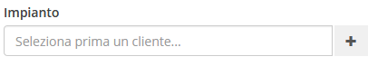
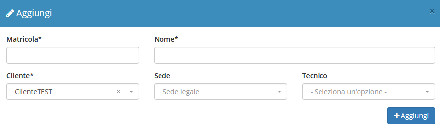
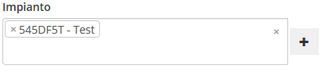

# Creazione

Utilizzando il calendario presente nella **Dashboard** è possibile aggiungere un intervento cliccando e trascinando il mouse, come nell'esempio che segue:

Creando un intervento come precedentemente indicato si hanno a disposizione una serie di campi da compilare, quali:

* Cliente
* Sede
* Per conto di
* Zona(definita automaticamente in base al _cliente_ selezionato,per maggiori informazioni, visitare la documentazione del modulo [**Zone**](../anagrafiche/zone.md))
* Preventivo
* Contratto
* Impianto
* Componenti
* Data e ora richiesta
* Tipo attività
* Stato
* Richiesta
* Inizio attività
* Fine attività
* Tecnici

## Creazione impianto al volo

Nella schermata di creazione di un nuovo intervento è permessa la creazione al volo di un _impianto_ relativa al nuovo record. Questa funzionalità viene permessa dal pulsante dedicato a destra del selettore del campo Impianto.

La gestione della creazione viene quindi delegata al modulo **MyImpianti**, permettendo l’inserimento delle informazioni standard documentate nella sezione relativa attraverso un _modal_ sovrapposto al resto del contenuto.

Una volta completata la creazione in questione, l’_impianto_ creato verrà automaticamente selezionato.

