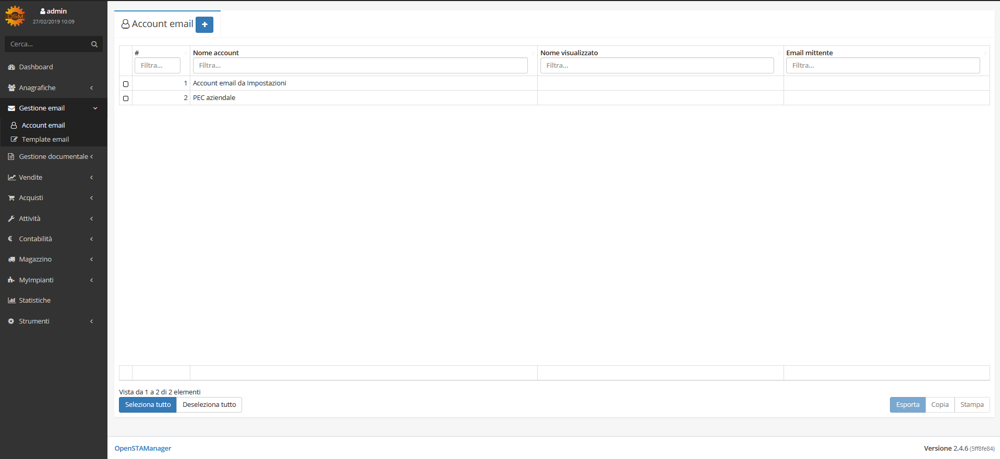
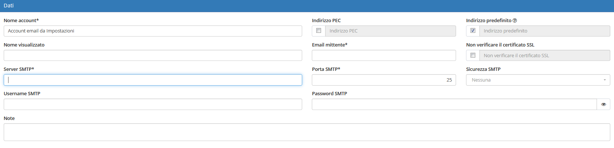

# Account email


Il modulo **Account email** permette all’azienda di gestire tutte le informazioni riguardanti gli account email utilizzati da OpenSTAManager per l'eventuale invio di email con contenuti specifici dei diversi moduli.


Questo modulo è complementare a [**Template email**](template.md), che si occupa di gestire le informazioni di base dell'email da inviare.

## Navigazione

Il modulo è raggiungibile attraverso il menu laterale del gestionale, sotto il link **Account email** visibile dall'espansione del menu **Gestione email**.

## Caratteristiche

La schermata principale del modulo è strutturata secondo la tabella generale predefinita.

### Creazione

La creazione di nuovi elementi segue il funzionamento standard del gestionale, necessitando il click sul pulsante apposito all'interno dell'intestazione del modulo.

Viene quindi data la possibilità di completare le informazioni di base del nuovo account email, quali:

* Nome dell'account
* Nome mostrato nelle email
* Indirizzo email

Il completamento di ulteriori informazioni viene permesso dalla schermata di modifica.

### Modifica

La schermata di modifica permette il completamento di tutte le informazioni che possono essere sfruttate per l'accesso all'account email specificato.

In particolare, vengono resi disponibili i seguenti campi relativi alla gestione di account SMTP:

* Server SMTP
* Username SMTP
* Password SMTP
* Porta SMTP
* Sicurezza SMTP

Viene inoltre permessa l'impostazione di un qualsiasi account email come predefinito per la creazione di nuovi template e la segnalazione di eventuali bug.

## Particolarità


L'account email predefinito impostato nelle versioni precedenti attraverso le impostazioni viene importato come _Account email da Impostazioni_.

