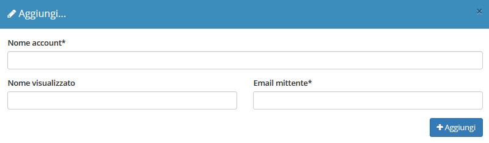

# ✉ Account email


Il modulo **Account email** permette all’azienda di gestire tutte le informazioni riguardanti gli account email utilizzati da OpenSTAManager per l'eventuale invio di email con contenuti specifici dei diversi moduli.


Questo modulo è complementare a [**Template email**](template.md), che si occupa di gestire le informazioni di base dell'email da inviare.

Il modulo si presenta con la seguente schermata:

 (1) (1).png>)

## ➕ Creazione

Cliccando sul tasto (+) è possibile registrare un nuovo account email.

Viene quindi data la possibilità di completare le informazioni di base del nuovo account email, quali:

* Nome dell'account
* Nome visualizzato nelle email
* Indirizzo email

## 🖌️ Modifica

La schermata di modifica permette il completamento di tutte le informazioni che possono essere sfruttate per l'accesso all'account email specificato.

In particolare, vengono resi disponibili i seguenti campi relativi alla gestione di account SMTP:

* Server SMTP
* Porta SMTP
* Sicurezza SMTP
* Username SMTP
* Password SMTP

 (1) (1).png>)

Viene inoltre permessa l'impostazione di un qualsiasi account email come predefinito per la creazione di nuovi template e la segnalazione di eventuali bug.


L'account email predefinito impostato nelle versioni precedenti viene importato come _Account email da Impostazioni_.



Per consentire a OpenSTAManager di comunicare in modo sicuro con il servizio email, è necessario [configurare l'OAuth2](../../faq/configurazione-oauth2.md).


## 💡 Configurazioni

Come configurare correttamente OpenSTAManager con il servizio di hosting:

### 📘 Aruba


Per configurare correttamente un account email Aruba all'interno di OpenSTAManager è necessario inserire le seguenti informazioni nel modulo [Account email](account.md):


* _Server SMTP_: `smtp.miodominio.ext`
* _Username SMTP_: indirizzo email (example@miodominio.ext, oppure example@miodominio.ext)
* _Porta SMTP_: `25`
* _Sicurezza SMTP_: `Nessuna`

 (1) (1).png>)


Nel caso in cui si continui a verificare l'errore: `PHPMailer: SMTP Error: Could not connect to SMTP host`, provare a disabilitare l'estensione PHP `openssl`.


### 📗 Gmail


Per configurare correttamente un account email Gmail all'interno di OpenSTAManager è necessario inserire le seguenti informazioni nel modulo [Account email](account.md):


* _Server SMTP_: `smtp.gmail.com`
* _Username SMTP_: indirizzo email (example@gmail.com, oppure example@domain.com)
* _Porta SMTP_: `587`
* _Sicurezza SMTP_: `TLS`

 (1) (1).png>)

L'account appena configurato può avere abilitata l'autenticazione a due fattori:

### 🔐 Autenticazione a due fattori

Se l'autenticazione a due fattori è abilitata, è necessario creare una chiave di accesso Google nella sezione dedicata: [https://myaccount.google.com/apppasswords](https://myaccount.google.com/apppasswords).

Sarà necessario selezionare il valore `Altra` del campo _Seleziona app_.

 (1).png>)

Verrà quindi reso disponibile un campo per la denominazione della nuova chiave. Una volta compilato il nome, cliccare sul pulsante GENERA.

.png>)

Comparirà quindi un messaggio di avvertenza relativo all'utilizzo della nuova chiave, che sarà copiabile dal testo evidenziato in giallo.

 (1).png>)

### 📂 App meno sicure

Nel caso **non** sia abilitata l'autenticazione a due fattori, è necessario procedere ad abilitare l'accesso da applicazioni meno sicure attraverso le impostazioni dell'account Google: [https://myaccount.google.com/lesssecureapps](https://myaccount.google.com/lesssecureapps).

 (1) (1).png>)

E' quindi necessario inserire nel campo _Password SMTP_ dell'account del gestionale la password originale dell'account Gmail.

## 📨Invio


La funzione di invio email è una caratteristica integrata in OpenSTAManager, che si basa sulle strutture fornite dai moduli **Account email** e **Template email** per semplificare la gestione delle informazioni relative.


Il sistema è accessibile all'interno di ogni _record_ dei moduli che possiedono almeno un template collegato, ed è accessibile attraverso il pulsante dedicato nella sezione in alto a destra della schermata.

Una volta cliccato sul pulsante relativo al template email da inviare, apparirà la seguente schermata:

 (1).png>)

Viene quindi reso possibile modificare alcuni valori predefiniti del template, quali:

* Oggetto
* Contenuto
* Notifica di lettura
* Stampe da allegare

Viene inoltre fornita la possibilità, oltre di impostare manualmente i destinatari, di allegare alcuni upload dell'anagrafica Azienda predefinita e dell'elemento di cui si sta effettuando la condivisione.
