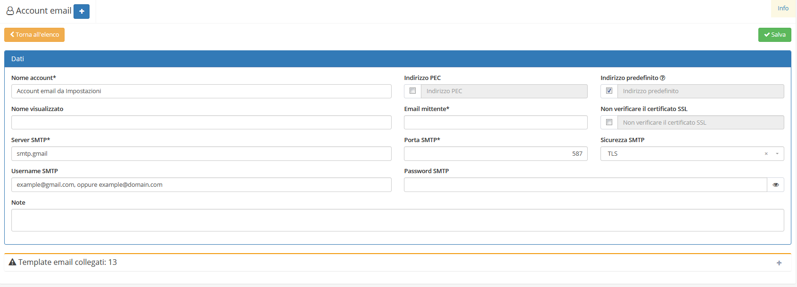
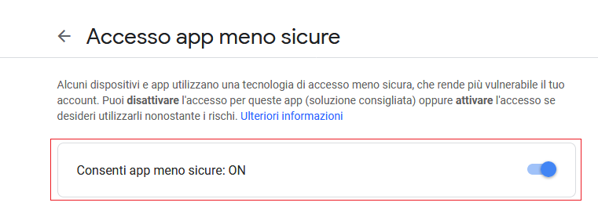
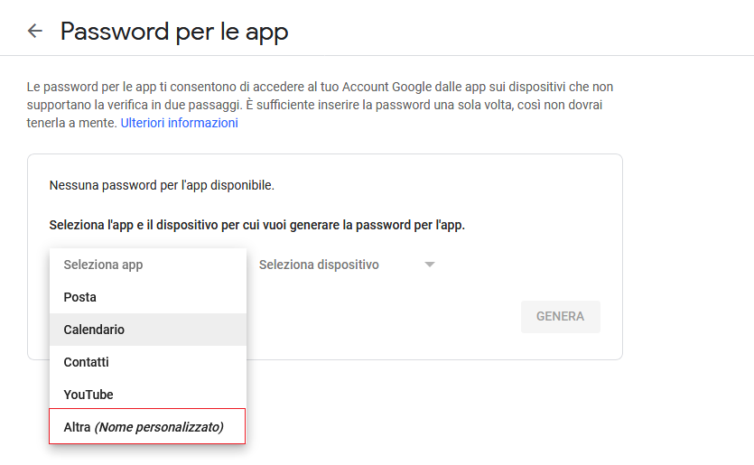
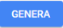
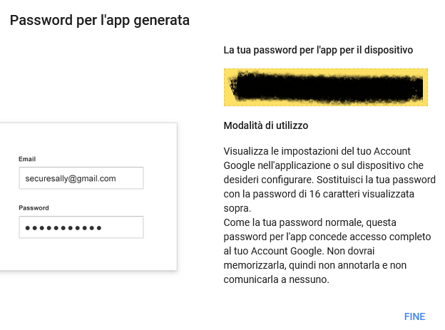

# Gmail


Per configurare correttamente un account email Gmail all'interno di OpenSTAManager è necessario completare nel seguente modo le informazioni dell'elemento del modulo [**Account email**](account.md):


* _Server SMTP_: `smtp.gmail.com`
* _Username SMTP_: indirizzo email (example@gmail.com, oppure example@domain.com)
* _Porta SMTP_: `587`
* _Sicurezza SMTP_: `TLS`

Se l'account da utilizzare è protetto attraverso il sistema di autenticazione a due fattori, visitare la [sezione relativa](https://github.com/devcode-it/devcode-it.github.io/tree/c372246fd4462ad0101f4f643f1719d85d3d3249/\_openstamanager/guide/modules/email/autenticazione-a-due-fattori/README.md). In alternativa, procedere con la guida _Applicazione meno sicure_.

## Applicazione meno sicure

Nel caso **non** sia abilitata l'autenticazione a due fattori, è necessario procedere ad abilitare l'accesso da applicazioni meno sicure attraverso le impostazioni dell'account Google: [https://myaccount.google.com/lesssecureapps](https://myaccount.google.com/lesssecureapps).

E' quindi necessario inserire nel campo _Password SMTP_ dell'account del gestionale la password originale dell'account Gmail.

## Autenticazione a due fattori

Se l'autenticazione a due fattori è abilitata, è necessario creare una chiave di accesso Google nella sezione dedicata: [https://myaccount.google.com/apppasswords](https://myaccount.google.com/apppasswords).

Una volta visitato il link precedente, comparirà il seguente contenuto. Sarà necessario selezionare il valore `Altra` del campo _Seleziona app_.

Verrà quindi reso disponibile un campo per la denominazione della nuova chiave. Una volta compilato il nome, cliccare sul pulsante  .

Comparirà quindi un messaggio di avvertenza relativo all'utilizzo della nuova chiave, che sarà copiabile dal testo evidenziato in giallo.

E' necessario inserire questa chiave nel campo _Password SMTP_ dell'account del gestionale.
