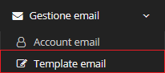
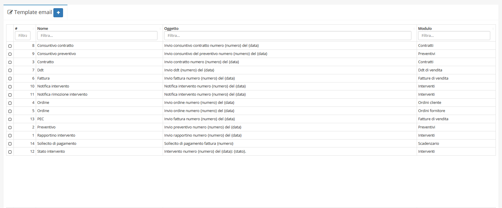
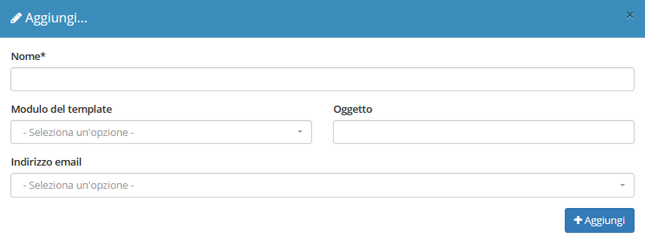
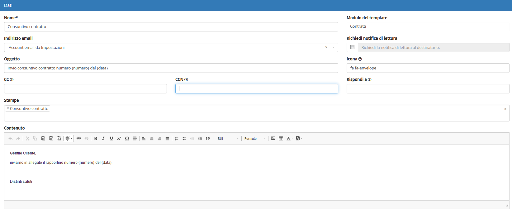
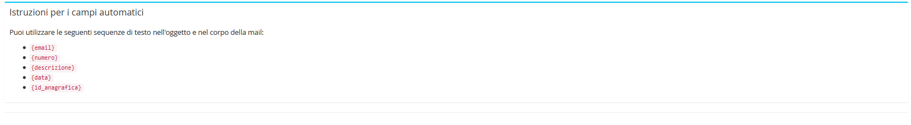

# Template email


Il modulo **Template email** permette all’azienda di gestire le informazioni di base riguardanti i contenuti e le caratteristiche delle email che OpenSTAManager può eventualmente procedere a inviare.


Questo modulo è complementare a [**Account email**](account.md), che si occupa di gestire le informazioni degli account email utilizzati per l'invio delle email.

## Navigazione

Il modulo è raggiungibile attraverso il menu laterale del gestionale, sotto il link **Template email** visibile dall'espansione del menu **Gestione email**.

## Caratteristiche

La schermata principale del modulo è strutturata secondo la tabella generale predefinita.

### Creazione

La creazione di nuovi elementi segue il funzionamento standard del gestionale, necessitando il click sul pulsante apposito all'interno dell'intestazione del modulo.

Viene quindi data la possibilità di completare le informazioni di base del nuovo template, quali:

* Nome del template
* Modulo relativo al template
* Oggetto del template
* [Account email](account.md) da utilizzare

Il completamento di ulteriori informazioni viene permesso dalla schermata di modifica.

### Modifica

La schermata di modifica permette il completamento di tutte le informazioni riguardanti il template.

In particolare, oltre ai campi previsti alla creazione, vengono resi disponibili i seguenti attributi:

* Notifica di lettura (per richiederla)
* Icona
* CC
* CCN
* Rispondi a
* Stampe da allegare (di default)
* Contenuto

Tra questi campi, _Contenuto_ e _Oggetto_ prevedono un sistema di autocompletamento per alcuni particolari valori definiti dal modulo. L'elenco completo di questi elementi viene reso disponibile nella sezione informativa **Istruzioni per i campi automatici**.

La sostituzione di queste componenti dipende dai contenuti del _record_ da cui viene inviata l'email. Per maggiori informazioni, visitare la documentazione di [invio email](invio.md).

È inoltre presente il pulsante **Duplica template** che permette di duplicare un template precedentemente creato.

## Particolarità

Sono presenti dei template predefiniti per diversi moduli, personalizzabili a piacimento.


Inserendo un'indirizzo email nel campo "**CC**" di un relativo **Template** ogni email verrà inviata anche all'indirizzo email inserito in "**CC"** oltre al destinatario principale dell'email. Questo, per esempio, può essere utile se voglio inviare un'email ad un **Cliente** e al commercialista.

