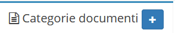
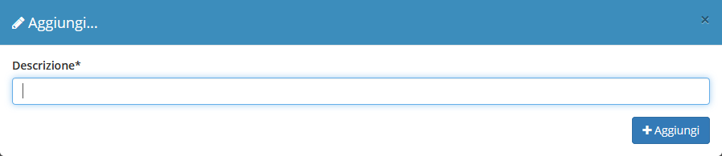

# Creazione

La creazione di nuovi elementi segue il funzionamento standard del gestionale, necessitando il click sul pulsante apposito all'interno dell'intestazione del modulo.

Successivamente si può proseguire alla creazione della categoria.

Il completamento di ulteriori informazioni viene permesso dalla schermata di [modifica](modifica1.md).
