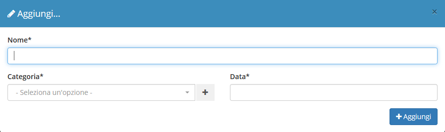

# Creazione

La creazione di nuovi elementi segue il funzionamento standard del gestionale, necessitando il click sul pulsante apposito all'interno dell'intestazione del modulo.

Il modulo **Gestione documentale** presenta la possibilità di gestire una serie di documenti attraverso la compilazione di alcuni campi, quali:

* Nome
* Categoria
* Data

Il completamento di ulteriori informazioni viene permesso dalla schermata di modifica.
