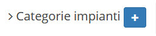
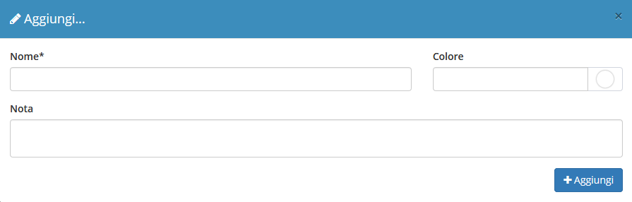

# Creazione

La creazione di nuovi elementi segue il funzionamento standard del gestionale, necessitando il click sul pulsante apposito all'interno dell'intestazione del modulo.


Il modulo **Categorie impianti** ha quindi la possibilità di creare una _categoria_ che permette di raggruppare determinati _impianti_.


Compilando i campi soprastanti si va a creare una nuova **Categoria di impianti**

