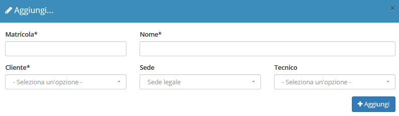

# Creazione

La creazione di nuovi elementi segue il funzionamento standard del gestionale, necessitando il click sul pulsante apposito all'interno dell'intestazione del modulo.

Il modulo **Impianti** presenta quindi la possibilità di inserire le informazioni di base relative al nuovo impianto da creare.

## Caratteristiche

Il sistema di creazione di un nuovo elemento richiede la compilazione di alcune informazioni fondamentali:

* Matricola dell'impianto
* Nome dell'impianto
* Cliente
* Sede
* Eventuale tecnico assegnato

