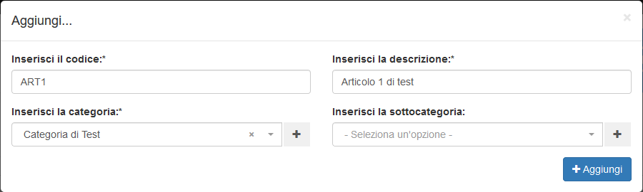
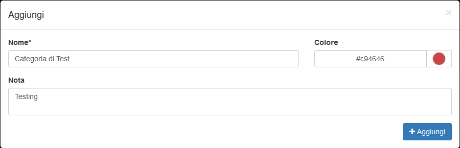
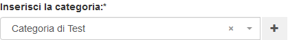

# Creazione

La creazione di nuovi elementi segue il funzionamento standard del gestionale, necessitando il click sul pulsante apposito all'interno dell'intestazione del modulo.

Il modulo **Articoli** presenta quindi la possibilità di inserire le informazioni complete relative alla nuova attività da creare.

## Caratteristiche

Il sistema di creazione di un nuovo elemento richiede la compilazione di alcune informazioni fondamentali:

* Codice dell'articolo
* Nome completo dell'articolo
* Categoria
* Eventuale sottocategoria

### Creazione categoria al volo


Nella schermata di creazione di un nuovo articolo viene permessa la creazione al volo delle **Categorie** relative al nuovo _record_. Questa funzionalità viene permessa dal pulsante dedicato a destra del selettore del campo _Categoria_.


La gestione della creazione viene quindi delegata al modulo **Categorie**, permettendo l'inserimento delle informazioni standard previste attraverso un _modal_ sovrapposto al resto del contenuto:

* Nome
* Colore
* Nota

Una volta completata la creazione in questione, la categoria creata verrà automaticamente selezionata.

Lo stesso procedimento è disponibile per il campo _**Sottocategoria**_.

