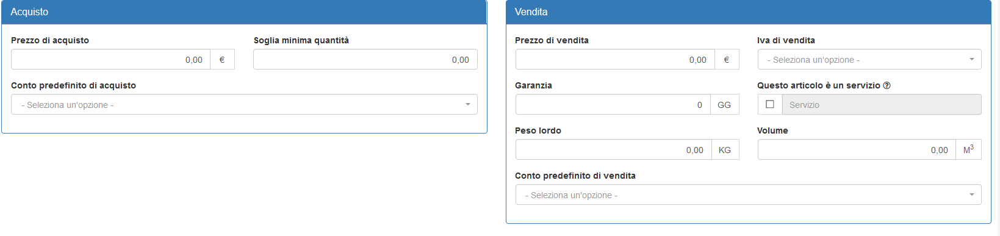

# Modifica

La sezione di modifica degli elementi del modulo segue il sistema standard del gestionale, necessitando il click sulla riga relativa al _record_ all'interno della tabella della schermata principale.

## Caratteristiche

Una volta all'interno di questa parte del sistema, il modulo **Articolo** permette di completare _tutte_ le informazioni che il gestionale supporta per l' articolo. In particolare, per permettere un maggiore senso logico nella navigazione dei dati, la sezione di modifica è suddivisa in 3 raggruppamenti:

* [Dati dell'articolo](modifica.md#dati-dellarticolo)
* [Dati di acquisto e vendita](modifica.md#dati-di-acquisto-e-vendita)
* [Componenti](modifica.md#componenti)
* [Listini](modifica.md#listini)

### Dati dell'articolo

Il primo raggruppamento di informazioni sull'articolo consiste nell'insieme delle informazioni basilari relative.

In particolare, attraverso questa sezione è possibile procedere alla modifica dei seguenti campi:

* Immagine
* Codice
* Categoria
* Sottocategoria
* Descrizione \(dal _Nome_ richiesto nella creazione\)
* Unità di misura predefinita
* Note eventuali
* Quantità disponibile

Vengono rese inoltre disponibili alcune altre opzioni estremamente importanti per la gestione interna dell'articolo:

* _**Abilita serial number**_ _\*\*_permette l'abilitazione della gestione dei numeri seriali per l'articolo
* _**Seleziona per rendere attivo l'articolo**_ permette, se disabilitato, di impedire l'utilizzo dell'articolo
* _**Modifica quantità manualmente**_ permette la creazione di un movimento manuale

### Dati di acquisto e vendita

Viene quindi presentata una selezione di campi relativi alle informazioni di acquisto e vendita relative all'articolo, suddivise rispettivamente nelle sezioni **Acquisto** e **Vendita**.

La componente **Acquisto** permette il completamento delle informazioni di:

* Prezzo di acquisto
* Soglia minima quantità\(per il widget **Articoli in esaurimento** nel modulo **Dashboard\)**
* Conto predefinito

La sezione **Vendita** presenta i seguenti campi:

* _Prezzo_
* _Iva predefinita_
* _Conto predefinito_
* _Garanzia_ \(in giorni\)
* _Volume_ \(in m^3\)
* _Peso lordo_ \(in KG\)
* _Questo articolo è un servizio_ \(disabilita la modifica della quantità per l'articolo\)

### Componenti

Il raggruppamento **Componenti** permette di gestire gli elementi del modulo **Gestione componenti** \(sotto **MyImpianti**\) collegati all'articolo.

### Listini

L'ultimo raggruppamento di informazioni presenta la previsione di rincaro/sconto relativa ad ogni listino registrato nel modulo **Listini**, permettendo in questo modo il calcolo automatico del prezzo effettivo in base al listino collegato all'anagrafica.

## Particolarità


L'immagine dell'articolo viene considerata a tutti gli effetti come un upload tradizionale.


