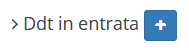

# Creazione

La creazione di nuovi elementi segue il funzionamento standard del gestionale, necessitando il click sul pulsante apposito all'interno dell'intestazione del modulo.

Il sistema di creazione di un nuovo elemento richiede la compilazione di alcune informazioni fondamentali:

