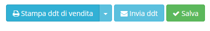

# Azioni aggiuntive

Selezionando o creando un _record_ in **Ddt in uscita** sono presenti nella parte in alto a destra dei _plugin_ che consentono diverse opzioni quali:

* Stampa ddt di vendita:
  * Stampa ddt di vendita\(senza costi\)
* Invia ddt\(mail\)

