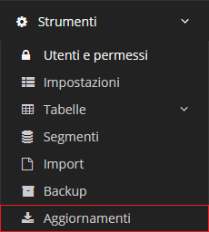
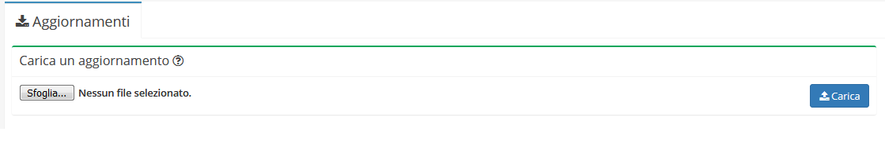
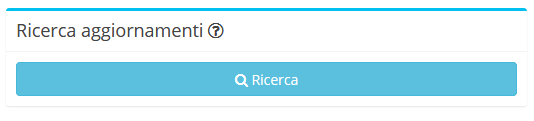

# Aggiornamenti


Il modulo **Aggiornamenti** offre diverse possibilità, quali:


* Carica un aggiornamento
* Ricerca aggiornamenti

## Navigazione

Il modulo è raggiungibile attraverso il menu laterale del gestionale, sotto il link **Strumenti**.

## Carica un aggiornamento

Form che permette di caricare:

* aggiornamenti del gestionale
* Innesti di moduli
* Innesti di plugin

## Ricerca aggiornamenti

Cliccando su _Ricerca_ il programma fa un controllo automatico della presenza di aggiornamenti del gestionale
