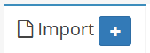
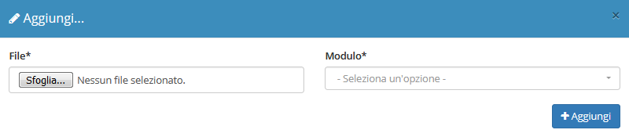

# Import


Il modulo **Import** permette di caricare dei file CSV per aggiungere dei record nel modulo _Articoli_ o _Anagrafiche._


## Navigazione

Il modulo è raggiungibile attraverso il menu laterale del gestionale, sotto il link **Strumenti**.

## Creazione

La creazione di nuovi elementi segue il funzionamento standard del gestionale, necessitando il click sul pulsante apposito all'interno dell'intestazione del modulo.

Selezionando un modulo sarà visibile un ulteriore pulsante  , facendo click con il mouse si aprirà un file CSV di esempio di come importare i dati.\
È possibile importare tre tipologie di dati:

* Anagrafiche (informazioni sulla creazione del file CSV su [Import anagrafiche](../anagrafiche/import-anagrafiche.md))
* Articoli (informazioni sulla creazione del file CSV su [Import articoli](../magazzino/articoli-1/import-articoli.md))
* Articoli (informazioni sulla creazione del file CSV su [Import listini](../magazzino/listini/import-listini.md))

Una volta creato il file CSV e selezionato sul campo **File,** cliccando sul tasto  apparirà questa schermata:

La quale mostrerà il contenuto di ogni colonna, se l'importazione è stata effettuata tenendo i stessi nomi delle colonne presenti nel file d'esempio i menù a tendina di ogni colonna saranno già selezionati automaticamente, in caso contrario selezionare manualmente le colonne corrispondenti.\
Cliccando su  il file viene importato nel modulo specificato.
