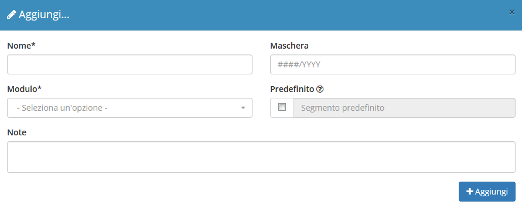
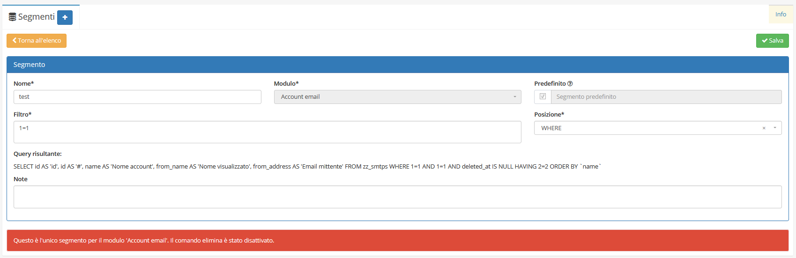
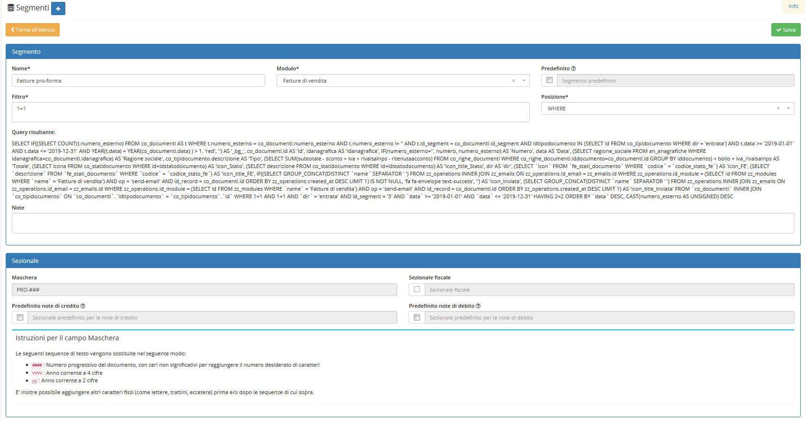
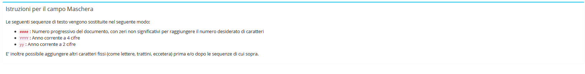

# Segmenti


Il modulo **Segmenti** permette di aggiungere delle opzioni selezionabili nei campi di creazione di un record di un determinato modulo.


## Navigazione

Il modulo è raggiungibile attraverso il menu laterale del gestionale, sotto il link **Strumenti**.

## Creazione

La creazione di nuovi elementi segue il funzionamento standard del gestionale, necessitando il click sul pulsante apposito all'interno dell'intestazione del modulo.

Dove si avranno questi campi da compilare:

Per concludere la creazione di un _segmento_ cliccare su **Aggiungi**, dove comparirà questa schermata:

_Spuntare_ **Predefinito** _per rendere il segmento predefinito._

## Modifica

La sezione di modifica degli elementi del modulo segue il sistema standard del gestionale, necessitando il click sulla riga relativa al _record_ all'interno della tabella della schermata principale.La sezione di modifica è suddivisa in 2 raggruppamenti:

* Segmento
* Sezionale

Si presenterà quindi questa schermata:

### Segmento

Nella sezione _**Segmento**_ è possibile modificare:

* Nome
* Modulo
* Predefinito
* Filtro
* Posizione

### Sezionale

Nella sezione _**Sezionale**_ è possibile fare la spunta su:

* Sezionale fiscale
* Predefinito note di credito(per renderlo predefinito per le note di credito)
* Predefinito note di debito(per renderlo predefinito per le note di debito)

## Istruzioni per il campo maschera

