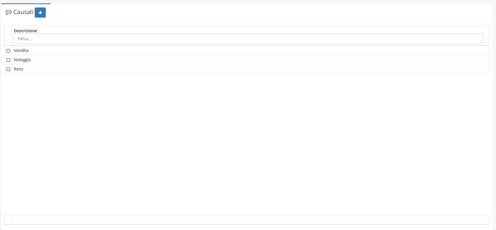
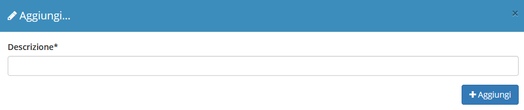

# Causali


Il modulo **Causali** permette di aggiungere nuove _causali_ al campo _**Causale trasporto**_ nella creazione di un **Ddt**:


## Navigazione

Il modulo è raggiungibile attraverso il menu laterale del gestionale, sotto il link **Tabelle** nel link **Strumenti**.

## Creazione

La creazione di nuovi elementi segue il funzionamento standard del gestionale, necessitando il click sul pulsante apposito all'interno dell'intestazione del modulo.

E' sufficiente inserire la _Descrizione_ per creare una nuova causale.

## Modifica

La sezione di modifica degli elementi del modulo segue il sistema standard del gestionale, necessitando il click sulla riga relativa al _record_ all'interno della tabella della schermata principale.

Si presenterà quindi questa schermata:

Spuntando la casella _**Causale predefinita**_ la suddetta causale sarà impostata come causale di trasporto predefinita per i _Ddt_.

Spuntando la casella _**Importabile?**_ la suddetta causale permetterà l'importazione a livello contabile del documento collegato in altri documenti (per esempio, in fatture).

Spuntando la casella _**Abilita storno**_ la suddetta causale permetterà di stornare il documento come nota di credito.
