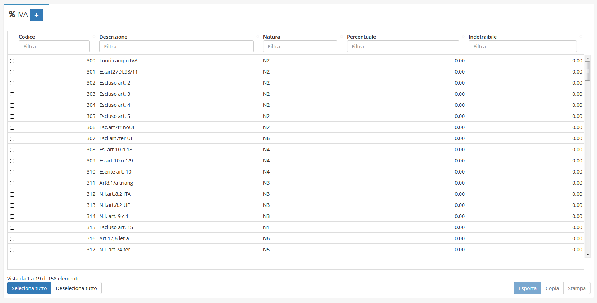
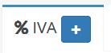

# IVA


Il modulo **IVA** consente di aggiungere una tipologia di IVA selezionabile nel rispettivo _campo_ nei vari moduli.


### Navigazione

Il modulo è raggiungibile attraverso il menu laterale del gestionale, sotto il link **Tabelle** nel link **Strumenti**.

### Creazione

La creazione di nuovi elementi segue il funzionamento standard del gestionale, necessitando il click sul pulsante apposito all'interno dell'intestazione del modulo.

Successivamente verrà richiesto di inserire:

* Descrizione
* Codice
* Esente
* Percentuale
* Indetraibile
* Codice Natura(Fatturazione Elettronica)

## Modifica

La sezione di modifica degli elementi del modulo segue il sistema standard del gestionale, necessitando il click sulla riga relativa al _record_ all'interno della tabella della schermata principale.

Si presenterà quindi questa schermata:

Dove sarà possibile modificare:

* Descrizione
* Esente
* Percentuale
* Indetraibile
* Codice
* Codice Natura(Fatturazione Elettronica)
* Esigibilità(Fatturazione Elettronica)
* Dicitura fissa in fattura
