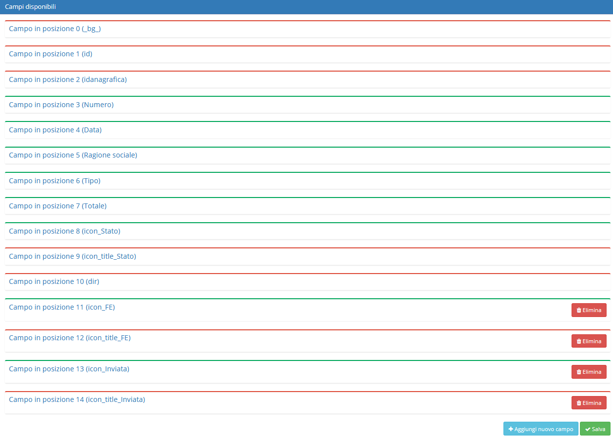
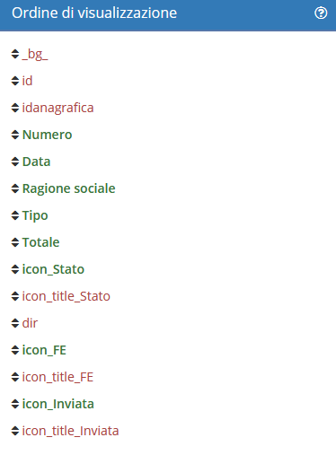

# Viste


Il modulo **Viste** permette di apportare delle modifiche alle tabelle contenenti i dati di ciascun modulo.


## Navigazione

Il modulo è raggiungibile attraverso il menu laterale del gestionale, sotto il link **Strumenti**

## Modifica

La sezione di modifica degli elementi del modulo segue il sistema standard del gestionale, necessitando il click sulla riga relativa al _record_ all'interno della tabella della schermata principale.

Una volta entrati in questa parte del sistema si può procedere al completamento e alla modifica del _record._

La schermata di modifica è divisa in:

* Opzioni generali
* Campi disponibili
* Ordine di visualizzazione
* Filtro per gruppo di utenti

Grazie a **Opzioni generali** è possibile modificare diversi campi, quali:

* Nome del modulo (modificare il nome che identifica il modulo)
* Query personalizzata (scrivere una query in sostituzione a quella di default)

Nelle query è possibile utilizzare dei segnaposto che verranno sostituiti come fossero delle variabili:

* **|select|**: viene sostituito con la lista dei campi da visualizzare definiti sotto
* **|date\_period(co\_documenti.data)|**: viene sostituito con "AND WHERE co\_documenti.data BETWEEN "data\_inizio" AND "data\_fine". "data\_inizio" e "data\_fine" vengono valorizzati in base al filtro di date selezionabile dal menu in alto a sinistra\
  \_\_ (1) (1) (1) (1) (1).png>)\\
* **1=1**: è necessario specificarlo subito dopo il WHERE per far sì che venga sostituito automaticamente con i filtri che l'utente digita nel modulo. In questo modo il sistema sa dove innestare i vari filtri tramite WHERE
* **2=2**: è come 1=1 ma funzione sulla clausola HAVING, utile per le ricerche tramite HAVING\\

Grazie a **Campi disponibili** è possibile cambiare:

* Gruppi con accesso (gruppi e utenti in grado di visualizzare quel campo)
* Visibilità (stato del campo, visualizzabile oppure nascosto)

Cliccando sopra un _record_ sono presenti 4 campi selezionabili:

* Ricercabile (indica se il campo è ricercabile)
* Ricerca lenta (selezionabile per indicare se la ricerca di quel campo è lenta)
* Sommabile (se il campo è da sommare a fine tabella)
* Formattabile (se formattare automaticamente il campo, ad esempio visualizzare la data nel formato italiano, inserire i separatori di decimali o migliaia, ecc...)

Grazie a **Ordine di visualizzazione** si può cambiare l'ordine dei campi trascinandoli:

