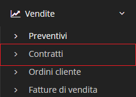

# Contratti


Il modulo **Contratti** permette di gestire le informazioni relative ai contratti dell'azienda.


## Navigazione

Il modulo è raggiungibile attraverso il menu laterale del gestionale, sotto il link **Contratti** visibile dall'espansione del menu **Vendite**.

## Caratteristiche

Questo modulo presenta presenta 4 [plugin](./) nella sezione di modifica del modulo:

* **Pianificazione fatturazione**
* **Pianificazione attività**
* **Consuntivo** per il monitoraggio del rapporto budget-spesa
* **Rinnovi**
