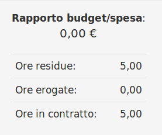

# Modifica

La sezione di modifica degli elementi del modulo segue il sistema standard del gestionale, necessitando il click sulla riga relativa al _record_ all'interno della tabella della schermata principale.

## Caratteristiche

La sezione di modifica del modulo **Contratti** permette di procedere alla modifica dei seguenti campi di base:

* Numero
* Nome
* Cliente
* Sede
* Agente
* Referente
* Validità
* Metodo di pagamento
* Date di bozza, accettazione, conclusione e rifiuto
* Stato
* Impianti interessati
* Esclusioni
* Descrizione

E' inoltre supportata la gestione dello _Sconto finale_ sul netto a pagare del contratto inserendo un valore nel campo **Sconto finale** in fase di modifica del documento.

### Dati appalto

Questa sezione è dedicata ai dati di appalto, le seguenti informazioni sono da specificare nel caso l'attività fosse effettuata verso la Pubblica amministrazione:

* Identificatore documento
* Numero riga
* Codice CIG
* Codice CUP

### Costi unitari

Grazie a questa sezione è possibile addebitare i costi orari, al kilometro e al diritto di chiamata in base al tipo di attività.

### Righe

Il modulo **Contratti** integra all'interno della sezione **Righe** la gestione delle spese relative ai propri elementi.

Cliccando sui pulsanti relativi, è possibile procedere quindi alla creazione di nuove spese relative al contratto:

* Articoli
* Barcode
* Righe (spese generiche)
* Descrizioni (righe dedicate alla stampa)
* Sconti e maggiorazioni

Una volta inserite correttamente le informazioni richieste, la nuova spesa verrà aggiunta all'elenco del contratto.

E' quindi possibile procedere alla modifica e all'eventuale rimozione della spesa attraverso i pulsanti dedicati della spesa.

### Attenzione


Se voglio monitorare il consumo delle ore mi basterà aggiungere una **Riga,** inserire una **descrizione,** selezionare **ore** come **Unità di misura** e inserire nel campo **Q.tà** il numero delle ore, come nell'esempio che segue:


Successivamente, cliccando in altro a destra su _Consuntivo_ si potrà visualizzare:

* Ore residue
* Ore erogate
* Ore in contratto

