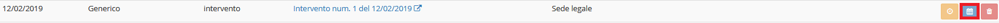
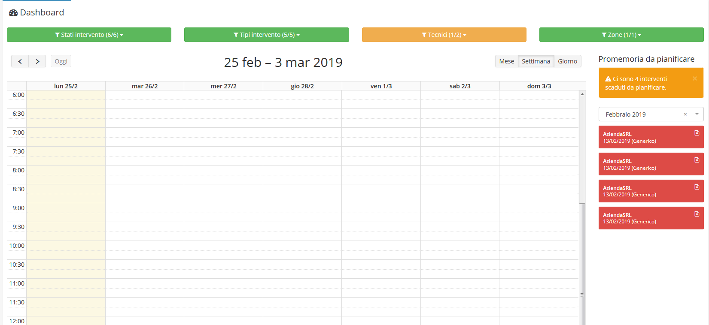

# 📅 Pianificazione attività

## Pianificazione attività


Il plugin **Pianificazione attività** è una componente del modulo **Contratti** dedicata alla completa gestione della pianificazione delle attività (_promemoria_) relative ai contratti registrati all'interno di OpenSTAManager.


## Navigazione

Il plugin è raggiungibile, all'interno dell'area di modifica di un _record_ del modulo **Contratti**, attraverso il menu dedicato sotto la dicitura **Pianificazione attività**.

## Caratteristiche

È possibile **pianificare dei "promemoria"** o direttamente gli **interventi** da effettuare entro determinate scadenze. Per poter pianificare i promemoria, il contratto deve avere **data accettazione** e **data conclusione** definita ed essere in uno dei seguenti stati: **In lavorazione, Fatturato, Pagato, Parzialmente fatturato.**\
\*\*\*\*La possibilità di creare nuovi elementi viene resa disponibile dal pulsante _Nuovo promemoria_ (dopo aver selezionato il tipo di promemoria) che apre una struttura grafiche, _modal_, sovrapposta agli altri contenuti.\\

### Creazione

Come descritto sopra, la creazione di nuovi elementi viene resa disponibile dal pulsante  . Una volta cliccato il pulsate, verrà aperta una schermata con la possibilità di completare le informazioni dell'elemento.

Ogni promemoria può possedere articoli, spese generiche e allegati indipendenti, oltre ai campi:

* Data del promemoria
* Tipo intervento
* Sede
* Impianti a contratto
* Descrizione

### Pianificazione ciclica

Una volta creato il promemoria, sarà possibile effettuare una pianificazione ciclica dello stesso attraverso seguente pulsante della relativa riga.

In fondo al _modal_ di riepilogo che compare dopo il click sul pulsante relativo, saranno visibili nuovi due raggruppamenti:

* _Promemoria ciclico?_
* _Pianificare interventi?_ per rendere automaticamente il promemoria un'attività

La pianificazione di promemoria ciclici replicherà in modo completo le caratteristiche del promemoria selezionato (compresi articoli, spese generiche e allegati), aggiornando le date di conseguenza.

### Trasformazione in attività

Una volta creato il promemoria, sarà possibile trasformarlo in attività in modo indipendente dalla funzione di **Pianificazione ciclica** attraverso il pulsante dedicato nella relativa riga.

Questa azione permetterà quindi di confrontarsi con la classica schermata per la creazione delle attività, pre-impostata secondo le caratteristiche del promemoria.

## Particolarità

I promemoria verranno successivamente visualizzati nel modulo **Dashboard** per semplificare la pianificazione del giorno dell'intervento, ad esempio nel caso di interventi con cadenza mensile.

## \*\*\*\*
