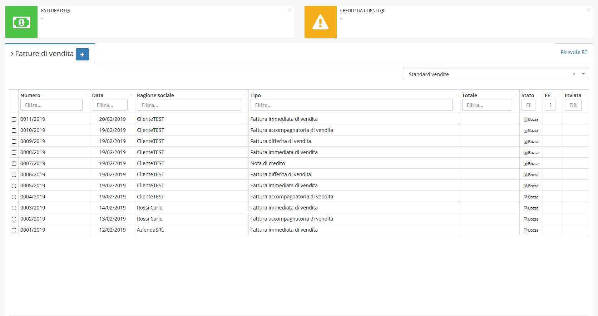
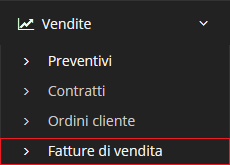

# Fatture di vendita


Il modulo **Fatture di vendita** permette all'utente di creare una fattura di vendita con la possibilità di verificare tramite _widget_, posti in alto, il _**Fatturato**_ ed eventuali _**Crediti da clienti**_, entrambi con IVA inclusa.


## Navigazione

Il modulo è raggiungibile attraverso il menu laterale del gestionale, sotto il modulo **Vendite**.

## Caratteristiche

La schermata principale del modulo è strutturata secondo la tabella generale predefinita. La modifica di un _record_ del modulo **Fatture di Vendita** presenta la possibilità di utilizzare diverse [Azioni aggiuntive](../ordinicliente/plugin1.md)

## Avvisi

Nel caso siano presenti delle fatture di vendita **generate** ma non ancora inviate (entro i 12 giorni dalla scadenza per inviare le fatture al SDI), verranno segnalate dal gestionale con un avviso nella sezione fatture di vendita.

 (1) (1).png>)

Verranno notificare anche le fatture che invece risulteranno **scartate** dal SDI e andranno quindi corrette e riemesse.

.png>)

## ➕ Creazione

## 🖌️ Modifica
