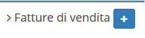

# Creazione

La creazione di nuovi elementi segue il funzionamento standard del gestionale, necessitando il click sul pulsante apposito all'interno dell'intestazione del modulo.

I campi da compilare che verranno visualizzati sono:

* Data
* Cliente
* Tipo fattura
* Sezionale

