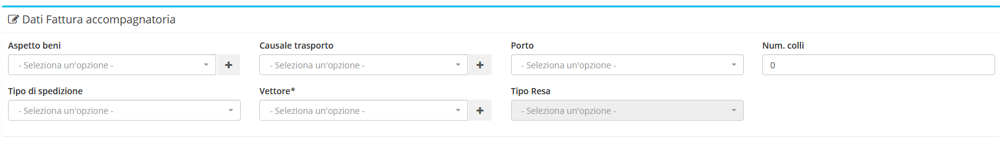

# Modifica

La sezione di modifica degli elementi del modulo segue il sistema standard del gestionale, necessitando il click sulla riga relativa al _record_ all'interno della tabella della schermata principale.

## Caratteristiche 

Una volta all'interno di questa parte del sistema, il modulo **Anagrafiche** permette di completare _tutte_ le informazioni che il gestionale supporta per le anagrafiche. In particolare, per permettere un maggiore senso logico nella navigazione dei dati, la sezione di modifica è suddivisa in 3 raggruppamenti:

* [Intestazione](modificafatturevendita.md#intestazione)
* [Righe](modificafatturevendita.md#righe)
* [Allegati](modificafatturevendita.md#allegati)

### Intestazione

Attraverso questa sezione, è possibile procedere alla modifica delle informazioni di base delle Fatture di vendita in questione:

* Data emissione
* Stato
* Stato FE
* Cliente
* Riferimento sede
* Agente di riferimento
* Tipo fattura
* Pagamento
* Banca
* Sconto incondizionato
* Split payment
* Fattura per conto terzi
* Note\(visibili anche in stampa\)
* Note aggiuntive\(interne\)

### Righe

Il modulo **Fatture di vendita** integra all'interno della sezione **Righe** la gestione delle spese relative ai propri elementi.

Cliccando sui pulsanti relativi, è possibile procedere quindi alla creazione di nuove spese relative alle **Fatture di vendita**:

* Intervento
* Preventivo
* Contratto
* Ddt
* Ordine
* Articolo
* Riga
* Descrizione

Una volta inserite correttamente le informazioni richieste, la nuova spesa verrà aggiunta all'elenco.

E' quindi possibile procedere alla modifica e all'eventuale rimozione della spesa attraverso i pulsanti dedicati della spesa.

### Dati fattura accompagnatoria

Questa sezione compare se si vuole fare una _fattura accompagnatoria di vendita_ e comporta l'inserimento dei seguenti campi:

* Aspetto beni
* Causale trasporto
* Porto
* Num.colli
* Tipo di spedizione
* Vettore
* Tipo resa

### Allegati

Il terzo e ultimo raggruppamento permette di **allegare** un file presente nel computer, specificando la categoria.

