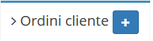

# Creazione

La creazione di nuovi elementi segue il funzionamento standard del gestionale, necessitando il click sul pulsante apposito all'interno dell'intestazione del modulo.

Il modulo **Ordini cliente** presenta quindi la possibilità di inserire le informazioni relative alla nuova anagrafica da creare, mostrando di default una versione basilare delle informazioni richieste.

