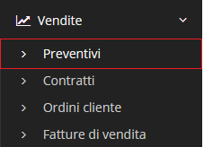

# Preventivi


Il modulo **Preventivi** permette di gestire le informazioni relative ai preventivi dell'azienda.


## Navigazione

Il modulo è raggiungibile attraverso il menu laterale del gestionale, sotto il link **Preventivi** visibile dall'espansione del menu **Vendite**.

