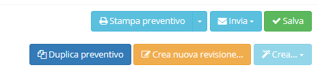

# ❗ Azioni aggiuntive

Selezionando o creando un _record_ in **Fatture di vendita** sono presenti nella parte in alto a destra degli strumenti che consentono diverse opzioni, quali:

* Stampa preventivo
  * Stampa preventivo (senza prezzi)
  * Stampa preventivo (senza totali)
  * Stampa consuntivo preventivo (senza prezzi)
  * Stampa consuntivo preventivo
  * Stampa preventivo (solo totale)
  * Stampa preventivo (senza totali)
  * Stampa consuntivo preventivo interno
* Invia
  * Invia preventivo
  * Invia consuntivo preventivo
* Duplica preventivo
* Crea nuova revisione
* Crea
  * Ordine cliente
  * Ordine fornitore
  * DDT in uscita
  * Contratto
  * Fattura

