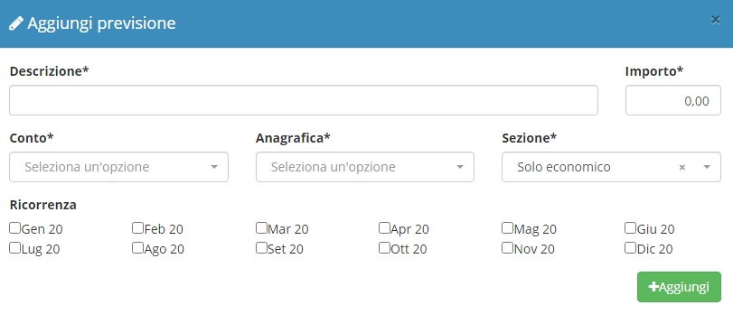

# Budget

**Budget** è uno dei diversi moduli acquistabili da **OpenSTAManager.** Permette di visualizzare sottoforma di grafico e tabella l'**andamento economico** (costi/ricavi) e l'**andamento finanziario** (entrate/uscite). Oltre all'andamento reale, permette di integrare anche le **previsioni di costi e ricavi**, e delle **entrate** e **uscite**.


[Clicca qui](https://www.openstamanager.com/categoria-prodotto/moduli/) per procedere all'acquisto, per maggiori informazioni sulle modalità di installazione e aggiornamento del modulo, consulta la [sezione dedicata](installazione-e-aggiornamento.md).


A seguito dell'installazione del modulo, cliccando su **Budget** apparirà il seguente prospetto che evidenzia l'**Utile totale**, dato dalla differenza tra ricavi e costi totali.

.png>)

Ponendo l'attenzione sui ricavi si può notare che i ricavi reali sono composti dalla somma delle fatture di vendita già contabilizzate, mentre i ricavi totali sono formati dalla somma di questi e i ricavi previsti da previsionali o sergenti dati esterne.

.png>)

Le **previsioni economiche** sono configurabili dal sotto-menu "Previsionale", da cui è possibile creare delle **previsioni di costi e ricavi**, con la possibilità di selezionare la ricorrenza.

Tra le **Sorgenti esterne** sono inserite di default delle query che è possibile abilitare o disabilitare, che vanno a imputare in previsionale i ricavi provenienti da DDT e da ordini clienti che sono stati accettati ma non ancora evasi.&#x20;

C'è inoltre la possibilità per utenti avanzati (o in caso di richiesta ai tecnici OpenSTAManager) di configurare delle query SQL che permettano di inserire ulteriori previsioni, ad esempio la previsione di ricavo di un preventivo.

Volendo analizzare nel dettaglio tutti i documenti che concorrono a costituire il valore di entrate e uscite, è possibile cliccare sull'importo interessato della tabella e si aprirà una schermata con i riferimenti alle diverse fatture.

.png>)

Inoltre, cliccando sul tasto "**+**" vicino a Ricavi e Costi, sarà possibile vedere la lista dei conti in cui ricavi e costi saranno rispettivamente imputati.

.png>)

L'**andamento finanziario**, a differenza di quello **economico**, attinge dati anche dallo scadenzario, e va quindi ad imputare tutte le scadenze previste nel relativo periodo di competenza.

Mentre la previsione di ricavo o di costo dell'andamento economico avviene per intero e in base ad una specifica data del documento, la previsione di entrata/uscita dell'andamento finanziario considera l'importo lordo e lo distribuisce in base al tipo di pagamento specificato nel documento o, se mancante, legato all'anagrafica a cui è collegato il documento.&#x20;

Ad esempio avendo una fattura di 100€(+IVA ordinaria 22%) e dovendola pagare con Ri.Ba. a 30/60gg, troveremo un primo pagamento di 61€ a 30 giorni e un secondo di pari valore a 60 giorni.&#x20;

