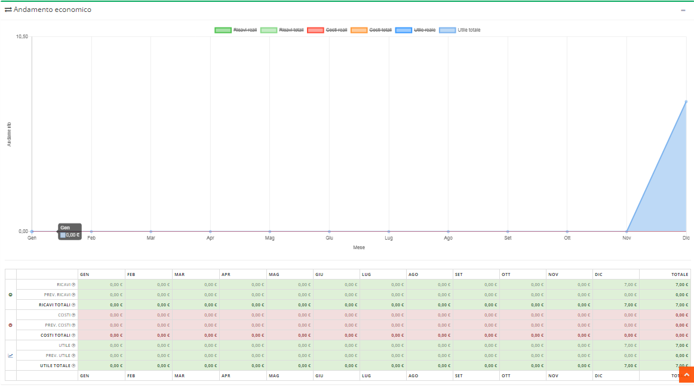
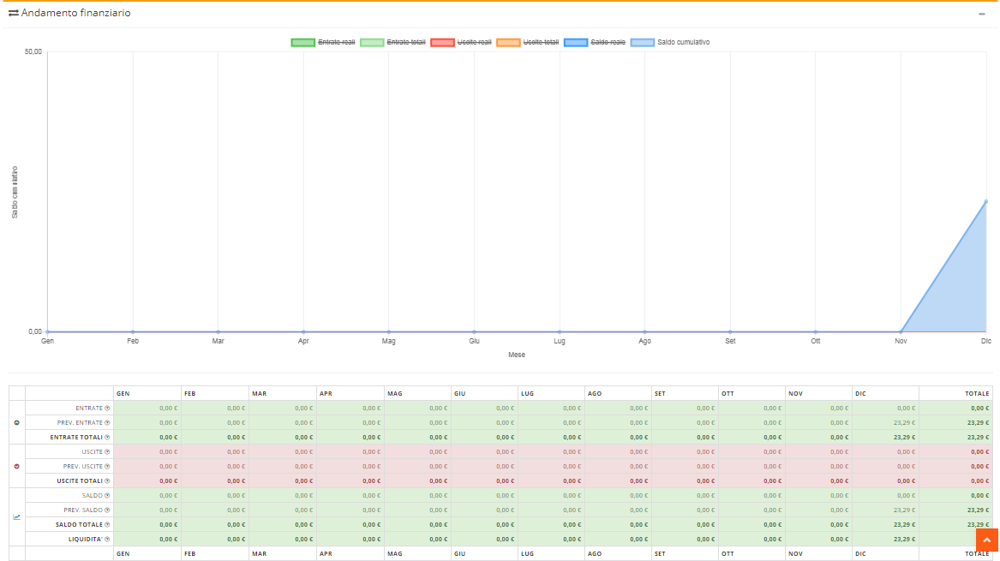
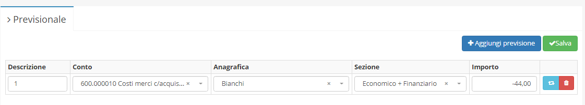

# Modulo Budget

**Budget** è uno dei diversi moduli acquistabili da **OpenstaSTAManager.** Il modulo permette permette di **vedere graficamente l'andamento economico e finanziario**, con la possibilità di aggiungere dati attraverso il previsionale.


[Clicca qui](https://www.openstamanager.com/categoria-prodotto/moduli/) per procedere all'acquisto


### Installazione e aggiornamento

Per maggiori informazioni sulle modalità di installazione e aggiornamento del modulo, consulta la [sezione dedicata](installazione-e-aggiornamento.md).

### Utilizzo

A seguito dell'installazione del modulo, cliccando su **Budget** apparirà alla destra la seguente schermata.

Per aggiungere dati previsionali, cliccando su **Budget -&gt; Previsionale** apparirà alla destra la seguente schermata dove si potranno aggiungere previsioni o modificare quelle già create.

