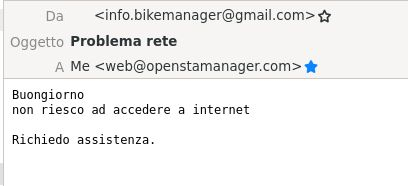

# 📗 Email ticketing

Il modulo **Email ticketing** permette la gestione delle richieste dei clienti via email direttamente dal gestionale.&#x20;


Questo modulo converte automaticamente in attività le email ricevute nella casella di posta selezionata.


Dall'interno delle attività così create, sarà possibile avviare una vera e propria chat con il cliente mediante il plugin Conversazioni, tenendo traccia così di tutte le interazioni con il cliente.


[Clicca qui](https://shop.openstamanager.com/prodotto/email-ticketing/) per acquistare **Email ticketing**.


.png>)

## ➕ Creazione

La prima cosa da fare è andare a configurare il proprio **IMAP**, cliccare su Gestione email/Email ticketing

.png>)

Si dovrà ora cliccare sul tasto (+) e andare a creare un nuovo account email dedicato (oppure configurare l'account predefinito), composto da diverse sezioni.

Nella prima, si dovranno compilare:

* Nome account
* IMAP hostname
* IMAP porta
* IMAP username
* IMAP password
* Cifratura connessione
* Cartella mail processate (cartella dell'account email dove verranno archiviate le email processate)
* Se disabilitare l'autenticazione
* Se validare il certificato

.png>)

Nella seconda troveremo le impostazioni predefinite della nuova attività che si andrà a creare:

.png>)

E infine nell'ultima troveremo le impostazioni relative al flusso email che seguiranno le conversazioni, qui andrà specificato:

* Se ricevere una notifica quando viene generata una nuova attività
  * L'indirizzo email a cui mandare la notifica
  * Il template da utilizzare
* Se inviare una notifica al cliente quando viene presa in carico l'attività
  * Il template da utilizzare
* Il template da utilizzare per rispondere al cliente
* Se ricevere una notifica quando il cliente risponde
  * L'indirizzo email a cui mandare la notifica
  * Il template da utilizzare

.png>)

## 🎛️ Configurazione


Il modulo email ticketing importa **tutte** le email presenti in Posta in arrivo.

E' consigliato quindi creare un'email ad-hoc per questo utilizzo, al fine di evitare l'importazione di attività pregresse già completate o la mancava importazione delle attività per timeout del server.


Dalla schermata di dettaglio di un'anagrafica sarà ora possibile configurare gli account email dai quali importare le attività quando arrivano sotto forma di richieste via mail.

Sarà qui possibile selezionare account mail diversi validi al momento della conversione di un'attività, per ogni account mail configurato per l'email ticketing.


Se l'email ricevuta proviene da un'account mail registrato in un'anagrafica verrà creata un'attività collegata a questa anagrafica.

In caso la mail ricevuta non sia registrata in nessuna anagrafica, l'attività verrà creata collegata all'anagrafica azienda.


.png>)

#### Esempio:

Si riceve una mail di richiesta di assistenza da parte di un cliente:

&#x20;                                                  

Nel modulo Attività si potrà ora vedere un intervento con stato Da pianificare.

.png>)

Dalla Dashboard è possibile visualizzare l'attività da programmare con la relativa richiesta del cliente. Da qui basterà trascinarla sul calendario per programmare un intervento.

.png>)

Cliccando sull'attività e accedendo al plugin Conversazioni sarà ora possibile visualizzare il messaggio ricevuto dal cliente, rispondervi e tener traccia delle conversazioni.

Per rispondere al cliente sarà sufficiente cliccare sul tasto Rispondi.

.png>)

Si aprirà quindi il template di risposta precedentemente selezionato, e spuntando Notifica di lettura, dalle conversazioni sarà possibile visualizzare quando il cliente visualizza la mail.

.png>)


Vedi anche:



[configurazione-oauth2.md](../configurazioni/configurazione-oauth2.md)


## 🏗️ Testing

Dopo aver configurato la casella IMAP si può testare la corretta configurazione del modulo aprendo sul browser l'indirizzo:

https://**indirizzo-installazione-osm**/plugins/imap/cron/index.php

dove /**indirizzo-installazione-osm**/ va sostituito con l'indirizzo dell'installazione in uso.


Questo script esegue l'importazione delle email e visualizza l'esito.

Da qui è quindi possibile verificare se la configurazione IMAP è corretta, o se il modulo genera errori.


La schermata che si presenterà sarà la seguente:

<figure><figcaption>
Esempio di importazione andata a buon fine
</figcaption></figure>

Una volta terminato il test di importazione occorre inserire in cron l'esecuzione di questo script ogni 5-10 minuti, così che la casella di posta venga scansionata periodicamente per avviare l'importazione automatica delle email.
