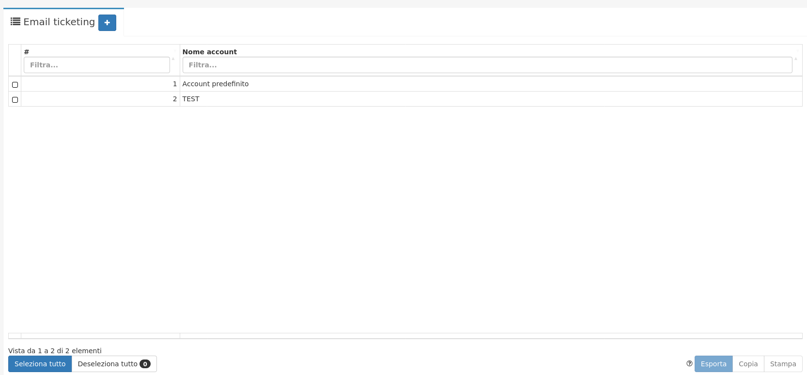

# Configurazione

La prima cosa da fare è andare a configurare Il proprio **IMAP**:

1. Cliccare su **Gestione email** e successivamente su **Email Ticketing**
2. Comparirà questa schermata:

.png>)

Dove sarà necessario compilare i seguenti campi della casella email:

* **Nome account**
* **Imap hostname**
* **Imap porta**
* **Imap username**
* **Imap password**
* **Cifratura connessione**
* **Cartella mail processate** (cartella dell'account email dove verranno archiviate le email processate)

E i seguenti campi riguardanti le attività:

* **Stato attività**
* **Tipo attività**
* **Template di invio mail** (da configurare come da immagine)

Finita la compilazione, per salvare le impostazioni, cliccare sul tasto **Salva** .

Ora tutto è pronto per utilizzare il modulo.
