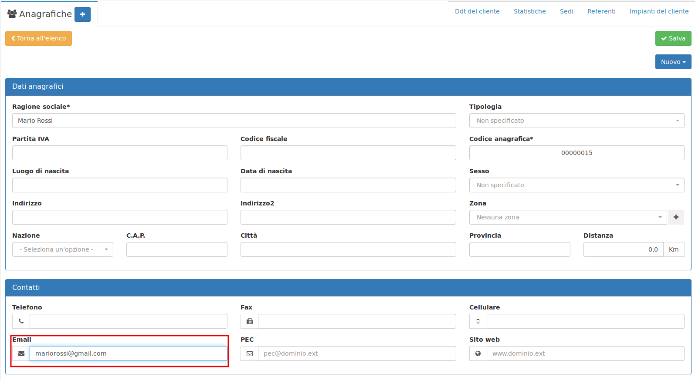
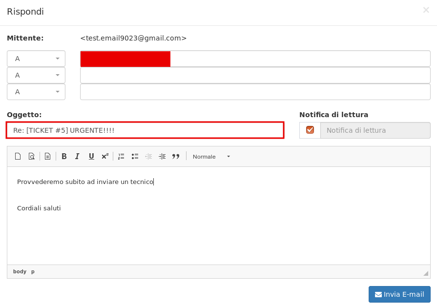
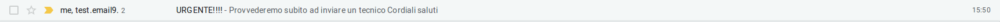
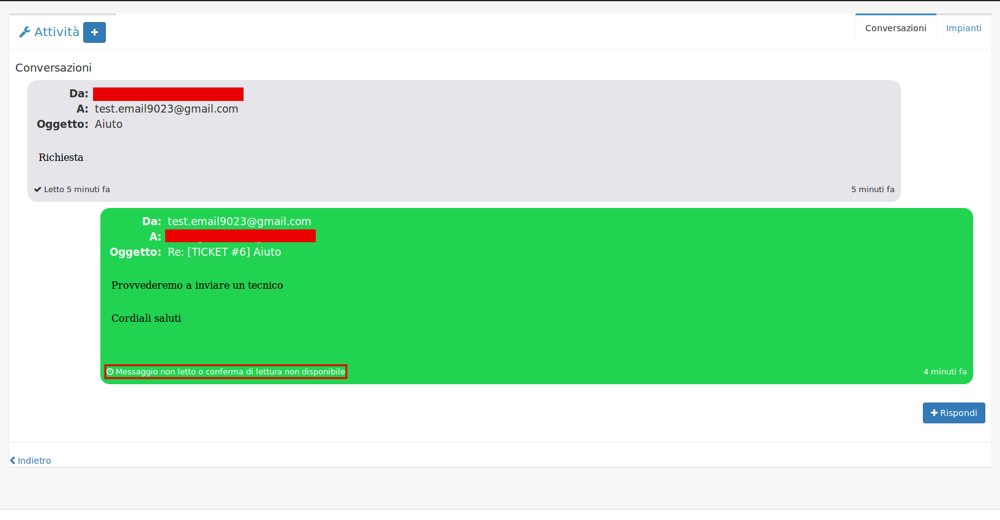

# Utilizzo


**Attenzione:** è importante sia inserito l'indirizzo di posta elettronica nell'**Anagrafica** del cliente, come nell'esempio che segue:


Grazie ad **Email ticketing** le richieste dei clienti inviate via email vengono direttamente trasformate in attività.

Esempio del funzionamento:

1.Il cliente invia un messaggio all'email configurata precedentemente in [**Creazione**](creazione.md)\*\*\*\*

2. Nel modulo **Attività** verrà creato l'intervento, in stato **Da pianificare** 

3. Cliccare sull'attività e in alto a destra fare click su **Conversazioni** 

4. Appariranno le **conversazioni** con il **cliente** via email, quindi apparirà anche la richiesta effettuata dal cliente nel punto 1

5. In fondo alla pagina è presente il tasto  , cliccare per rispondere alla richiesta del **cliente**.

Spuntando **Notifica di lettura** potrò vedere se il **cliente** ha visualizzato la mail. 

7. L' email è stata inviata al **cliente** correttamente

**Conversazioni** permette di creare una vera e propria chat con il **cliente,** come nell'esempio che segue:

E' possibile anche notare il messaggio **Messaggio non letto o conferma di lettura non disponibile.** Questo messaggio appare o quando il **cliente** non ha ancora visualizzato il messaggio o quando non è disponibile la conferma di lettura**.**

