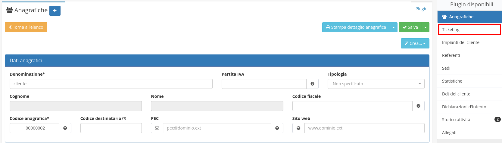
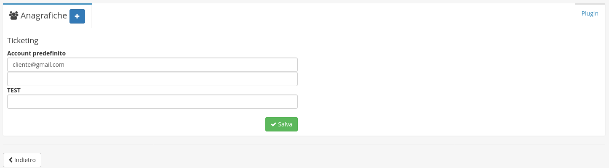
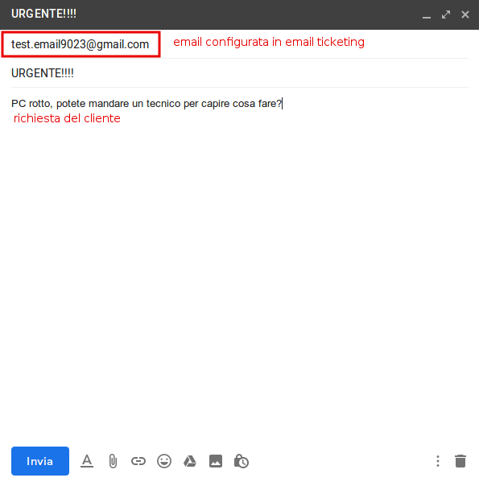
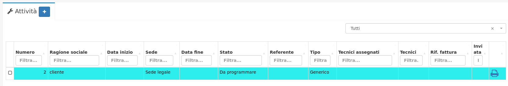
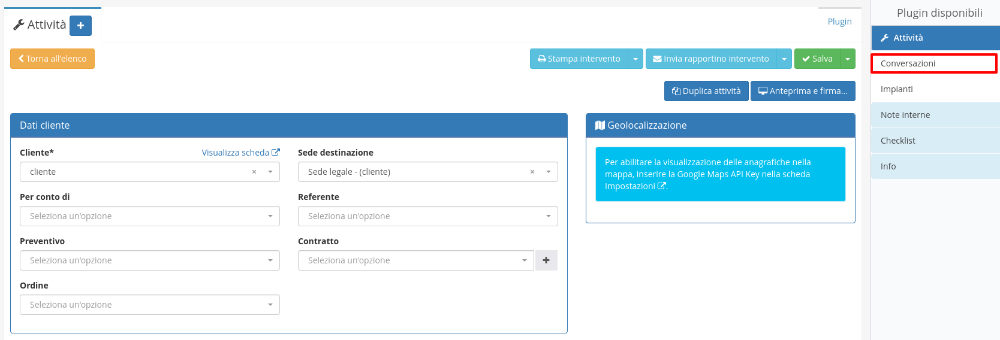
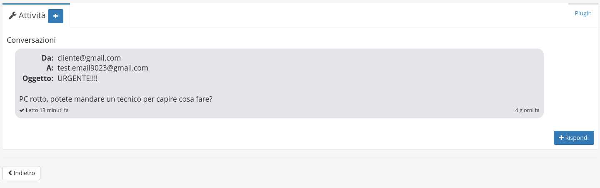

# Utilizzo


L'utilizzo del modulo email ticketing consiste nel convertire in Attività le mail in arrivo nelle caselle email precedentemente configurate, con la possibilità di rispondere  alle mail direttamente dall'attività creata.


Per collegare la mail in arrivo all'anagrafica del cliente è necessario andare ad associare gli indirizzi email all'anagrafica corrispondente, nel seguente modo:

Dalla schermata di modifica del modulo Anagrafiche sarà accessibile il plugin **Ticketing** in cui è possibile andare ad associare uno o più indirizzi email che serviranno poi appunto per l'apertura dell'attività.

Grazie ad **Email ticketing** le richieste dei clienti inviate via email vengono direttamente trasformate in attività.

Esempio del funzionamento:

Il cliente invia un messaggio all'email configurata precedentemente in [**Creazione**](creazione.md)

Nel modulo **Attività** verrà creato l'intervento, in stato **Da pianificare**

Cliccare sull'attività e in alto a destra fare click su **Conversazioni**

Appariranno le **conversazioni** con il **cliente** via email, quindi apparirà anche la richiesta effettuata dal cliente nel punto 1

In fondo alla pagina è presente il tasto  , cliccare per rispondere alla richiesta del **cliente**.

Spuntando **Notifica di lettura** potrò vedere se il **cliente** ha visualizzato la mail.

L' email è stata inviata al **cliente** correttamente

**Conversazioni** permette di creare una vera e propria chat con il **cliente,** come nell'esempio che segue:

E' possibile anche notare il messaggio **Messaggio non letto o conferma di lettura non disponibile.** Questo messaggio appare o quando il **cliente** non ha ancora visualizzato il messaggio o quando non è disponibile la conferma di lettura.
