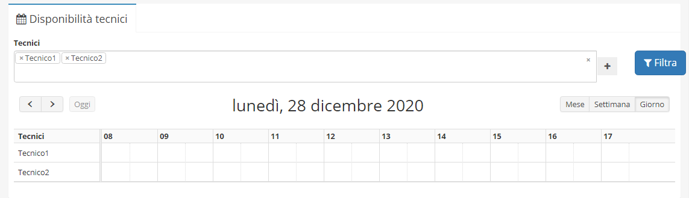
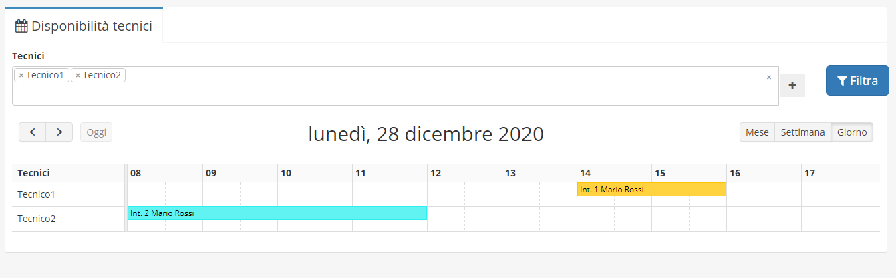

# Disponibilità tecnici

**Disponibilità tecnici** è uno dei diversi moduli acquistabili da **OpenstaSTAManager.** Il modulo permette di **gestire la disponibilità dei tecnici**, con la possibilità di selezionare più tecnici e mostrare la loro disponibilità in diversi formati(mese/settimana/giorno).


[Clicca qui](https://www.openstamanager.com/categoria-prodotto/moduli/) per procedere all'acquisto


### Installazione e aggiornamento

Per maggiori informazioni sulle modalità di installazione e aggiornamento del modulo, consulta la [sezione dedicata](installazione-e-aggiornamento.md).

### Utilizzo

A seguito dell'installazione del modulo, cliccando su **Disponibilità tecnici** apparirà alla destra la seguente schermata.

Attraverso l'applicazione del filtro questo modulo offre una visione degli **Interventi** in base al tecnico e al calendario selezionato, \*\*\*\* e permette uno sguardo più approfondito su determinate operazioni.

Grazie al calendario è inoltre possibile creare interventi direttamente dal modulo.

Cliccando su un intervento nel calendario è possibile accedere alla schermata di modifica corrispondente.
