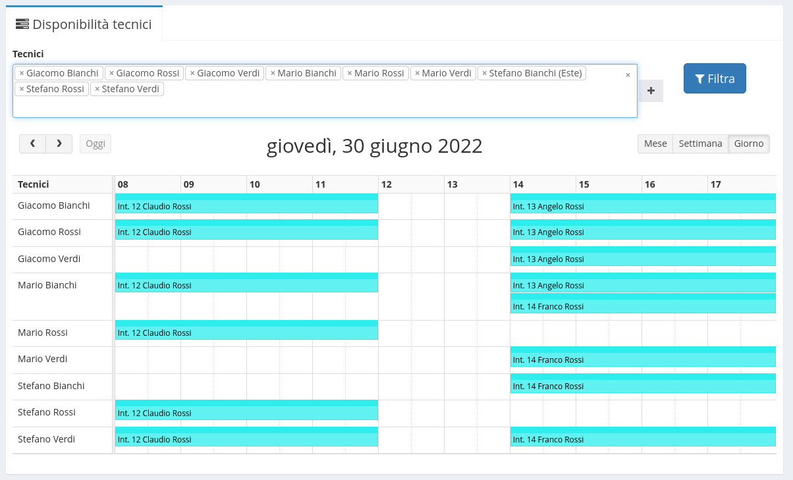

# 📗 Disponibilità tecnici

**Disponibilità tecnici** è uno dei diversi moduli acquistabili da **OpenSTAManager.**&#x20;

Questo modulo è una rivisitazione del modulo Dashboard che permette di organizzare l'attività dei singoli tecnici con maggiore efficienza e controllo.

Le attività segnate a calendario infatti, vengono suddivise per operatore, permettendo con un rapido colpo d'occhio di conoscere la disponibilità dei propri tecnici in base alla giornata/settimana/mese.


[Clicca qui](https://shop.openstamanager.com/prodotto/disponibilita-tecnici/) per procedere all'acquisto


A seguito dell'installazione del modulo, cliccando su **Disponibilità tecnici** apparirà la seguente schermata:

.jpeg>)

Attraverso l'applicazione dei filtri questo modulo offre una visione degli **Interventi** in base al tecnico e al tipo di vista selezionati.

<figure><figcaption></figcaption></figure>

Da qui, cliccando direttamente sul calendario, è possibile andare a programmare una nuova attività.

<figure><figcaption></figcaption></figure>

L'attività appena creata sarà ora visualizzabile in calendario e sarà possibile vederne i dettagli passandoci sopra il mouse.

<figure><figcaption></figcaption></figure>

Cliccando su un intervento nel calendario è possibile accedere alla sua schermata di dettaglio, da dove è possibile apportare modifiche, stamparne le specifiche, inviare il rapportino e la notifica di presa in carico, e accedere al pannello di anteprima e firma.

<figure><figcaption></figcaption></figure>
