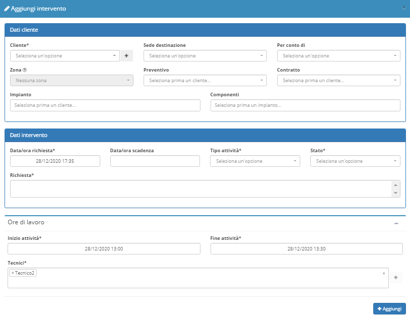

# 📗 Disponibilità tecnici

**Disponibilità tecnici** è uno dei diversi moduli acquistabili da **OpenSTAManager.** Il modulo permette di **gestire la disponibilità dei tecnici**, con la possibilità di selezionare più tecnici e mostrare la loro disponibilità in diversi formati(mese/settimana/giorno).


[Clicca qui](https://shop.openstamanager.com/prodotto/disponibilita-tecnici/) per procedere all'acquisto


A seguito dell'installazione del modulo, cliccando su **Disponibilità tecnici** apparirà la seguente schermata:

.jpeg>)

Attraverso l'applicazione del filtro questo modulo offre una visione degli **Interventi** in base al tecnico e al calendario selezionato, e permette uno sguardo più approfondito su determinate operazioni.

Grazie al calendario è inoltre possibile creare interventi direttamente dal modulo.

Cliccando su un intervento nel calendario è possibile accedere alla schermata di modifica corrispondente.
