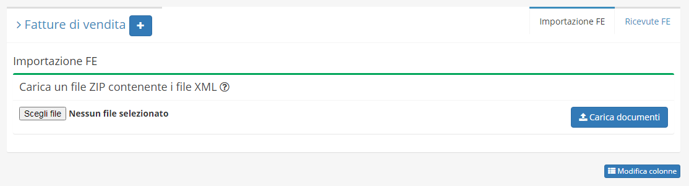

# Import FE

**Import FE** è un modulo acquistabile da **OpenstaSTAManager.** Il modulo permette di importare in OSM le fatture elettroniche relative al ciclo attivo \(vendita\).

Sarà possibile procedere all’importazione del pregresso caricando **archivi .zip contenenti uno o più file .xml**.

Il modulo permetterà di:

* Importare correttamente a sistema la fattura di vendita
* Censire automaticamente il cliente in anagrafiche \(se non presente\)
* Generare i corretti movimenti nello scadenzario e in prima nota


[clic](https://www.openstamanager.com/prodotto/modulo-import-fe-ciclo-attivo/)[ca qui](https://www.openstamanager.com/prodotto/modulo-import-fe-ciclo-attivo/) per procedere all'acquisto


### Installazione e aggiornamento

Per maggiori informazioni sulle modalità di installazione e aggiornamento del modulo, consulta la [sezione dedicata](installazione-e-aggiornamento.md).

### Utilizzo

A seguito dell'installazione del modulo, cliccando su **Vendite -&gt; Fatture di Vendita** apparirà in alto a destra il menù dei plugin, cliccando su **Importazione FE** apparirà la schermata seguente.

