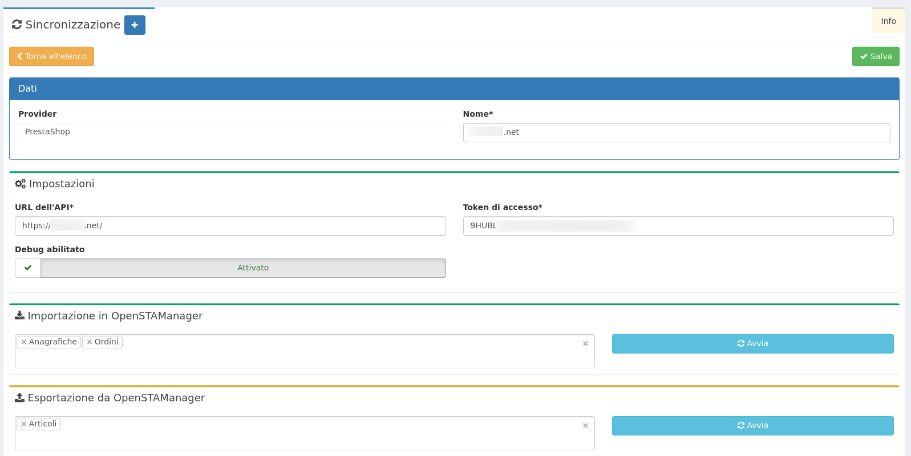

# E-commerce

**Sincronizzazione** è uno dei diversi moduli acquistabili da **OpenstaSTAManager.** Il modulo è dedicato alla **gestione delle operazioni di sincronizzazione** del gestionale OpenSTAManager verso servizi esterni attraverso una procedura basata sul concetto di importazione ed esportazione dei dati.

Servizi/Provider al momento disponibili:

* PrestaShop
* WooCommerce 


[Clicca qui](https://www.openstamanager.com/categoria-prodotto/moduli/) per procedere all'acquisto


## Installazione e aggiornamento

Per maggiori informazioni sulle modalità di installazione e aggiornamento del modulo, consulta la [sezione dedicata](installazione-e-aggiornamento.md).

## Utilizzo

A seguito dell'installazione del modulo, cliccando su **Sincronizzazione** apparirà alla destra la seguente schermata.

* **url dell'api**: è l'indirizzo del sito web token di accesso: è la chiave generata da prestashop per poter interagire con i web services
* **importazione in openstamanager**: definisce quali dati importare in openstamanager da prestashop \(disponibili: articoli, anagrafiche, ordini\) 
* **esportazione da openstamanager**: definisce quali dati inviare da openstamanager a prestashop \(disponibili: articoli, anagrafiche, ordini\)

