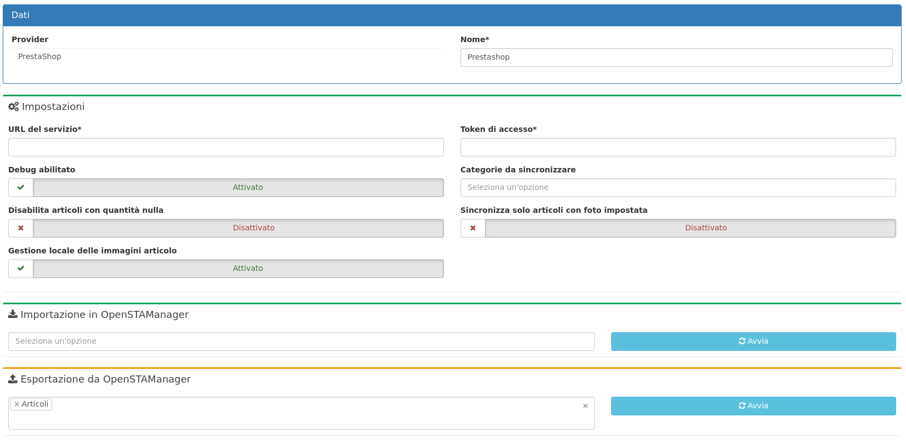

# 📗 E-commerce


Il modulo è dedicato alla **gestione delle operazioni di sincronizzazione** del gestionale con servizi esterni attraverso una procedura basata sul concetto di importazione ed esportazione dei dati.


Servizi/Provider al momento disponibili:

* PrestaShop
* WooCommerce


[Clicca qui](https://www.openstamanager.com/categoria-prodotto/moduli/) per procedere all'acquisto


A seguito dell'installazione del modulo, cliccando su **Sincronizzazione** apparirà alla destra la seguente schermata.

* **URL del servizio**: è l'indirizzo del sito web di E-commerce
* **Token di accesso**: è la chiave generata dal provider per poter interagire con i web services
* **Debug abilitato:** se attivato mostra l'eventuale avviso di errore in fase di esportazione/importazione.
* **Categorie da sincronizzare:** menù a tendina multiplo che permette di esportare sul sito di E-commerce solo gli articoli delle categorie selezionate.
* **Disabilita articoli con quantità nulla:** se questa impostazione è attiva, in fase di esportazione articoli viene disattiva la visualizzazione sul sito di E-commerce se la quantità è a 0 e quindi non disponibile a magazzino.
* **Sincronizza solo articoli con foto impostata:** questa impostazione esporta solo gli articoli che hanno una foto impostata nella scheda articolo di OSM
* **Gestione locale delle immagini articolo**: se attivata, in fase di importazione articoli aggiorna l'immagine dell'articolo su OSM
* **importazione in OpenSTAManager**: definisce quali dati importare in OpenSTAManager dal provider (disponibili: articoli, anagrafiche, ordini)
* **esportazione da OpenSTAManager**: definisce quali dati inviare da OpenSTAManager al provider (disponibili: articoli, anagrafiche, ordini)


Ogni modifica effettuata nella sezione **Impostazioni** viene aggiornata premendo il pulsante **Salva** presente in alto a destra nella schermata.





Una volta configurate le impostazioni del modulo **Sincronizzazione** è possibile eseguire manualmente la sincronizzazione selezionando una risorsa da importare/esportare e premendo successivamente **Avvia**.



Se l'esportazione va in errore, provare a collegarsi alle api del webservice, digitando dal browser l'url dell'E-commerce, aggiungendo "/api" all'url e inserendo come password il token corrispondente.\
Se non vengono visualizzate le risorse disponibile sarà necessario inserire nel file .htaccess del webservice la seguente stringa:

```
RewriteEngine on
RewriteCond %{HTTP:Authorization} ^(.*)
RewriteRule . - [E=HTTP_AUTHORIZATION:%1]
```


Per la risorsa articoli vengono sincronizzati da OpenSTAManager i campi codice, barcode, descrizione articolo, descrizione breve e completa, friendly url, quantità, prezzo di acquisto e di vendita, l'immagine principale e le immagini aggiuntive (gestite come allegati del prodotto).\
In seguito alla vendita su Prestashop vengono decrementate le quantità anche di conseguenza in OpenSTAManager.

Per definire i campi da esportare è accessibile inoltre un nuovo plugin **Info** **sincronizzazione** che è presente nel menù di destra nella schermata di modifica degli **Articoli** in cui è possibile definire le informazioni aggiuntive che verranno sincronizzate nell'E-commerce con la possibilità di disattivare l'articolo dalla sincronizzazione:


