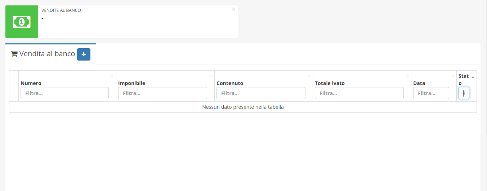

# 📗 Vendita al banco

**Vendita al banco** è uno dei diversi moduli acquistabili da **OpenstaSTAManager.** Il modulo permette la vendita al banco di prodotti con o senza codice a barre.


[Clicca qui](https://www.openstamanager.com/prodotto/vendita-al-banco/) per procedere all'acquisto


## Installazione e aggiornamento

Per maggiori informazioni sulle modalità di installazione e aggiornamento del modulo, consulta la [sezione dedicata](../installazione-e-aggiornamento.md).

Di seguito sono elencati i parametri consigliati per il registratore di cassa:

* PARAMETRI COMUNICAZIONE PROTOCOLLO: **XON/XOFF**
* BAUNDRATE: **9600**
* BIT NUMBER: **\[8,NONE,1]**
* XON-XOFF TX FOOTER: **\[DISABILITATO]**
* XON-XOFF TX ECO: **\[DISABILITATO]**
* HANDSHAKE: **\[XON/XOFF]**
* MODO FPU: **\[DISABILITATO]**
* CANALE PC: **\[Ethernet]**
* VIRGOLA INCLUSA: **SI**
* ECHO FULL: **NO**

## Utilizzo

A seguito dell'installazione del modulo, cliccando su **Vendita al banco** apparirà alla destra la schermata seguente.

