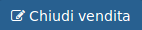

# Azioni aggiuntive

In alto a destra è presente il tasto  il quale mi permette di cambiare lo **Stato** da **Aperto** a **Pagato**.

.png)

E' possibile però riaprire la vendita cliccando su un record con **Stato** _**Pagato**_ **\*\*e cliccare il tasto**  **\*\*.** In questo modo lo **Stato** passerà da **Pagato** a\_\* Aperto\\\_\*.

.png)
