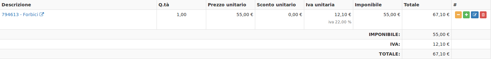

# Creazione


Il modulo **Vendita al banco** presenta quindi la possibilità di inserire le informazioni di base relative al nuovo impianto da creare. La creazione di nuovi elementi segue il funzionamento standard del gestionale, necessitando il click sul pulsante apposito all'interno dell'intestazione del modulo.


Il modulo **Vendita al banco** presenta quindi la possibilità di inserire le informazioni relative ad una nuova vendita. Esso è composto da due sezioni:

* Intestazione
* Articoli

### Intestazione

La sezione **Intestazione** si presenta nel seguente modo:

Suddivisa nei campi:

* Numero
* Data Ora
* Stato
* Magazzino
* Pagamento
* Note

Il campo **Numero** e **Data Ora** vengono compilati automaticamente grazie al numero progressivo generato automaticamente e alla data e ora della creazione della nuova vendita.

Lo **Stato** può essere **Aperto** o **Chiuso** . Se lo stato è aperto vuol dire che gli articoli non sono ancora stati pagati, se invece è chiuso vuol dire che è stato effettuato il pagamento. Per sapere come cambiare lo **Stato** [cliccare qui](azioni-aggiuntive.md)

Il **Pagamento** presenta due possibilità: **Rimessa diretta** o **Contanti**

**Note** presenta la possibilità di aggiungere delle note interne

### Articoli

La sezione **Articoli** si presenta nel seguente modo:

Suddivisa in due campi:

* Aggiungi un articolo tramite codice
* Articolo
* E una tabella, dove verranno visualizzate una serie di informazioni riferite all'articolo, come nell'esempio che segue:

Un articolo può essere aggiunto in due differenti maniere:

1. Andando a specificare il codice in **Aggiungi un articolo tramite codice.** Inserendo il codice di un articolo nel magazzino e premendo sul tasto  se il codice è corretto, l'articolo si aggiungerà alla tabella sottostante, altrimenti il campo **Aggiungi un articolo tramite codice** lampeggerà di rosso.
2. Andando a selezionare su **Articolo** l'articolo interessato.

### Particolarità 

Una volta inserito un articolo posso eseguire diverse azioni grazie a questi pulsanti  :

* Cliccando il pulsante  vado a decrementare la quantità dell'articolo di 1.
* Cliccando il pulsante  vado ad aumentare la quantità dell'articolo di 1.
* Cliccando il pulsante  posso andare ad applicare un **Prezzo unitario,** uno **Sconto unitario** e l'**IVA**.
* Cliccando il pulsante  vado a rimuovere l'articolo.

