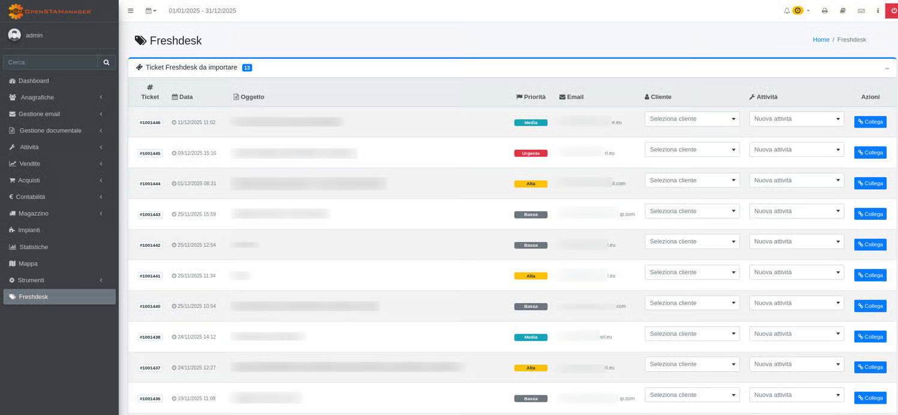

# 📗 Freshdesk Import


Il modulo Freshdesk Import è un'estensione per OpenSTAManager che facilita l'integrazione tra il sistema di gestione ticket Freshdesk e le attività gestite in OpenSTAManager. Attraverso un'interfaccia intuitiva, permette di visualizzare, selezionare e importare i ticket da Freshdesk, creando automaticamente le corrispondenti attività o collegandole a quelle esistenti.


### Funzionalità

* **Visualizzazione dei ticket Freshdesk non ancora importati**: Lista dei ticket disponibili su Freshdesk che non sono stati ancora importati in OpenSTAManager
* **Associazione di ticket a attività esistenti**: Possibilità di collegare un ticket Freshdesk a un'attività già presente in OpenSTAManager
* **Creazione di nuove attività a partire dai ticket**: Generazione automatica di nuove attività in OpenSTAManager basate sui dati del ticket Freshdesk
* **Tagging automatico dei ticket importati su Freshdesk**: Aggiunta automatica di un tag ai ticket importati per evitare duplicazioni
* **Visualizzazione dei dettagli del ticket all'interno dell'attività**: Scheda dedicata "Ticket Freshdesk" all'interno dell'attività per visualizzare tutte le informazioni del ticket associato

<figure><figcaption></figcaption></figure>

### Configurazione

Per utilizzare il modulo è necessario configurare le seguenti impostazioni:

1. **Freshdesk API Key**: La chiave API per accedere a Freshdesk
   * Ottenibile dal pannello di amministrazione di Freshdesk
   * Necessaria per l'autenticazione alle API Freshdesk
2. **Freshdesk Domain**: Il dominio Freshdesk (es. azienda.freshdesk.com)
   * Indica l'istanza Freshdesk a cui connettersi
   * Non includere il protocollo (http/https)
3. **Freshdesk Import Tag**: Il tag da aggiungere ai ticket importati
   * Default: `imported_to_osm`
   * Questo tag viene applicato automaticamente ai ticket importati per evitare di importarli nuovamente

Queste impostazioni possono essere configurate direttamente nel modulo dalla sezione di configurazione.

### Utilizzo

#### Importazione di un Ticket

1. Accedere al modulo "Importa Ticket Freshdesk" dal menu Strumenti
2. Configurare le impostazioni di Freshdesk se non ancora fatto
3. Il modulo mostrerà automaticamente la lista dei ticket Freshdesk non ancora importati
4. Per ogni ticket da importare:
   * Selezionare il cliente associato al ticket
   * Opzionalmente, selezionare un'attività esistente a cui collegare il ticket
5. Cliccare sul pulsante "Collega" per associare il ticket all'attività selezionata o per creare una nuova attività

#### Visualizzazione dei Ticket Importati

Una volta importato, il ticket sarà visibile nella scheda "Ticket Freshdesk" dell'attività associata. Da questa scheda è possibile visualizzare tutti i dettagli del ticket, inclusi:

* Oggetto e descrizione
* Informazioni sul richiedente
* Priorità
* Data di creazione e aggiornamento

#### Gestione dei Tag

Il modulo utilizza il tag configurato in "Freshdesk Import Tag" per identificare i ticket già importati. È possibile modificare questo tag in qualsiasi momento dalla configurazione del modulo.

***

## Changelog

Tutti i maggiori cambiamenti di questo progetto saranno documentati in questo file. Per informazioni più dettagliate, consultare il log GIT della repository su GitHub.

Il formato utilizzato è basato sulle linee guida di [Keep a Changelog](http://keepachangelog.com/), e il progetto segue il [Semantic Versioning](http://semver.org/) per definire le versioni delle release.

### 2.0 (2026-03-19)

#### Aggiunto (Added)

* Allineamento della configurazione Rector alle cartelle effettive del progetto
* Supporto per PHP 8.3 tramite Rector
* Configurazione di php-cs-fixer per la formattazione del codice
* Namespace PSR-4 `Modules\FreshdeskImport\` per l'autoloading

#### Modificato (Changed)

* Allineamento dei percorsi di Rector a `freshdesk_import/src`, `freshdesk_import/ajax`, `freshdesk_import/plugins`
* Aggiornamento del nome del package a `modulo-freshdesk-import`
* Aggiornamento della descrizione del package per riflettere la funzionalità di importazione Freshdesk
* Aggiornamento del file `package.json` con metadati corretti del modulo

#### Corretto (Fixed)

* Correzione dei percorsi di configurazione in `rector.php` per evitare errori di analisi

### 1.0 (2024-01-01)

#### Aggiunto (Added)

* Modulo di importazione ticket da Freshdesk
* Visualizzazione dei ticket Freshdesk non ancora importati
* Associazione di ticket a attività esistenti
* Creazione di nuove attività a partire dai ticket
* Tagging automatico dei ticket importati su Freshdesk
* Visualizzazione dei dettagli del ticket all'interno dell'attività
* API wrapper per l'integrazione con Freshdesk
* Configurazione delle impostazioni Freshdesk (API Key, Domain, Import Tag)
* Interfaccia di selezione per clienti e attività
* Supporto per OpenSTAManager 2.4.x
* Requisiti: PHP 7.2+, accesso API a Freshdesk
