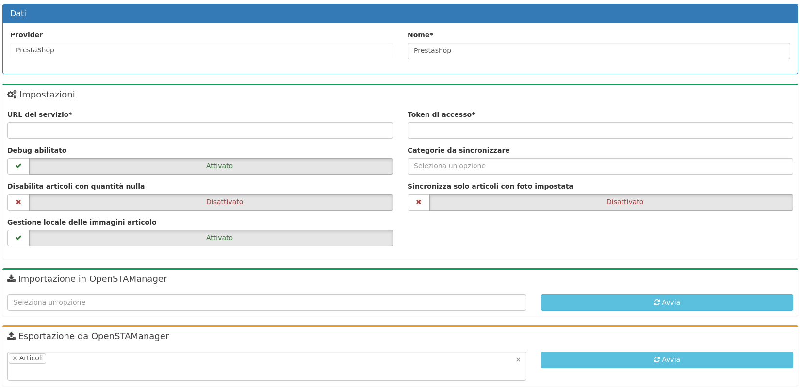
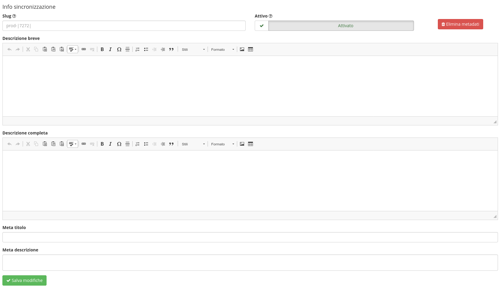

# 📗 E-commerce


Il modulo è dedicato alla **gestione delle operazioni di sincronizzazione** del gestionale con servizi esterni attraverso una procedura basata sul concetto di importazione ed esportazione dei dati.



La **sincronizzazione** è attualmente gestita con le piattaforme di e-commerce PrestaShop, WooCommerce e Shopify, in questo modo:


<table><thead><tr><th width="266">Importazione da ecommerce</th><th width="93">Versione</th><th width="87" data-type="checkbox">Articoli</th><th width="89" data-type="checkbox">Marche</th><th width="63" data-type="checkbox">Q.tà</th><th width="81" data-type="checkbox">Ordini</th><th width="125" data-type="checkbox">Anagrafiche</th></tr></thead><tbody><tr><td>Prestashop </td><td>>= 1.7.0</td><td>false</td><td>true</td><td>true</td><td>true</td><td>true</td></tr><tr><td>Woocommerce </td><td>>= 7.0</td><td>true</td><td>false</td><td>false</td><td>false</td><td>false</td></tr><tr><td>Shopify</td><td>>= 2.0</td><td>true</td><td>false</td><td>true</td><td>true</td><td>true</td></tr></tbody></table>

<table><thead><tr><th width="265">Esportazione da OSM</th><th width="93">Versione</th><th width="87" data-type="checkbox">Articoli</th><th width="89" data-type="checkbox">Marche</th><th width="62" data-type="checkbox">Q.tà</th><th width="79" data-type="checkbox">Ordini</th><th width="126" data-type="checkbox">Anagrafiche</th></tr></thead><tbody><tr><td>Prestashop </td><td>>= 1.7.0</td><td>true</td><td>true</td><td>true</td><td>false</td><td>false</td></tr><tr><td>Woocommerce</td><td>>= 7.0</td><td>true</td><td>false</td><td>false</td><td>false</td><td>false</td></tr><tr><td>Shopify</td><td>>= 2.0</td><td>false</td><td>false</td><td>true</td><td>false</td><td>false</td></tr></tbody></table>


La sincronizzazione delle marche, combinazioni articolo e delle funzionalità non selezionate nella tabella sono ancora in via di sviluppo.



Il modulo è stato testato con la sincronizzazione di circa 1000 records per ciascuna risorsa (anagrafiche, articoli e ordini).



[Clicca qui](https://shop.openstamanager.com/prodotto/e-commerce/) per procedere all'acquisto


A seguito dell'installazione del modulo, cliccando su **Sincronizzazione** apparirà alla destra la seguente schermata.

* **URL del servizio**: è l'indirizzo del sito web di E-commerce
* **Token di accesso**: è la chiave generata dal provider per poter interagire con i web services
  * PrestaShop: [https://www.edupass.it/manuali/manualistica-passweb/manuale-siti-ecommerce?a=manuale-passweb-ecommerce/marketplace/altri-marketplace/prestashop/attivazione-api-prestashop](https://www.edupass.it/manuali/manualistica-passweb/manuale-siti-ecommerce?a=manuale-passweb-ecommerce/marketplace/altri-marketplace/prestashop/attivazione-api-prestashop)
  * WooCommerce: [https://woocommerce.com/document/woocommerce-rest-api/#section-2](https://woocommerce.com/document/woocommerce-rest-api/#section-2)
* **Debug abilitato:** se attivato mostra l'eventuale avviso di errore in fase di esportazione/importazione.
* **Categorie da sincronizzare:** menù a tendina multiplo che permette di esportare sul sito di E-commerce solo gli articoli delle categorie selezionate.
* **Disabilita articoli con quantità nulla:** se questa impostazione è attiva, in fase di esportazione articoli viene disattiva la visualizzazione sul sito di E-commerce se la quantità è a 0 e quindi non disponibile a magazzino.
* **Sincronizza solo articoli con foto impostata:** questa impostazione esporta solo gli articoli che hanno una foto impostata nella scheda articolo di OSM
* **Gestione locale delle immagini articolo**: se attivata, in fase di importazione articoli aggiorna l'immagine dell'articolo su OSM
* **importazione in OpenSTAManager**: permette l'importazione degli articoli dal provider a OpenSTAmanager
* **esportazione da OpenSTAManager**: permette l'esportazione degli articoli da OpenSTAManager al provider


Ogni modifica effettuata nella sezione **Impostazioni** viene aggiornata premendo il pulsante **Salva** presente in alto a destra nella schermata.





**Prima di procedere con la prima sincronizzazione consigliamo di eseguire un Backup.**


Una volta configurate le impostazioni del modulo **E-commerce** è possibile eseguire manualmente la sincronizzazione selezionando una risorsa da importare/esportare e premendo successivamente **Avvia**.

Se l'esportazione va in errore, provare a collegarsi alle api del webservice, digitando dal browser l'url dell'E-commerce, aggiungendo "/api" all'url e inserendo come password il token corrispondente.\
Se non vengono visualizzate le risorse disponibile sarà necessario inserire nel file .htaccess del webservice la seguente stringa:

```
RewriteEngine on
RewriteCond %{HTTP:Authorization} ^(.*)
RewriteRule . - [E=HTTP_AUTHORIZATION:%1]
```

Per la risorsa articoli vengono sincronizzati da OpenSTAManager i campi:

* codice
* barcode
* descrizione articolo
* descrizione breve e completa
* friendly url
* quantità
* prezzo di acquisto e di vendita
* l'immagine principale
* le immagini aggiuntive (gestite come allegati del prodotto).

In seguito alla vendita su Prestashop vengono decrementate le quantità anche di conseguenza in OpenSTAManager.

Per definire i campi da esportare è accessibile inoltre un nuovo plugin **Info** **sincronizzazione** che è presente nel menù di destra nella schermata di modifica degli **Articoli** in cui è possibile definire le informazioni aggiuntive che verranno sincronizzate nell'E-commerce con la possibilità di disattivare l'articolo dalla sincronizzazione:



