# 3⃣ v3.0.30

L'app si apre sulla schermata di login, dove si dovranno inserire:

* l'URL dell'installazione
* Username
* Password


In questa guida effettueremo l'accesso all'installazione demo versione 2.4.41 utilizzando:

URL: demo.osmcloud.it/2441

Username: tecnico

Password: tecnicotecnico


.jpg>)

Una volta effettuato l'accesso l'app controllerà la disponibilità di aggiornamenti:

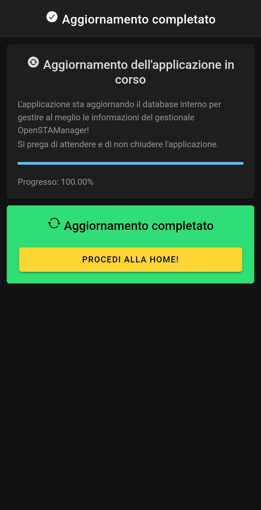

### 🏠 Home

Cliccando su PROCEDI ALLA HOME! si aprirà quindi la schermata **Home**, dove sarà possibile visualizzare il Riepilogo attività s

uddivise in:

* attività programmate per la data odierna
* attività programmate per la settimana corrente e non ancora concluse
* attività programmate per il prossimo periodo

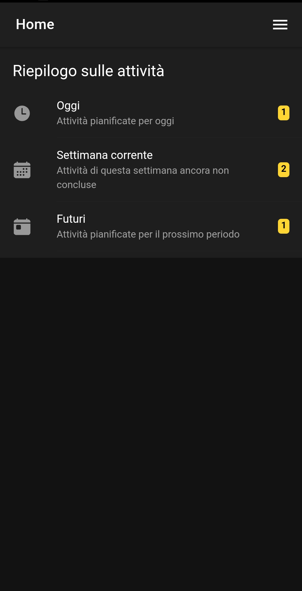

Cliccando sulle tre lineette in corrispondenza del tasto Home sarà possibile accedere al menu, dove sarà possibile visualizzare:

* L'account dal quale si è effettuato l'accesso, e l'indirizzo dell'installazione
* Home
* Clienti
* Attività
* Promemoria
* Articoli
* Movimenta
* Impianti
* Mappa
* Configurazione
* Lo stato della sincronizzazione
* La versione dell'app

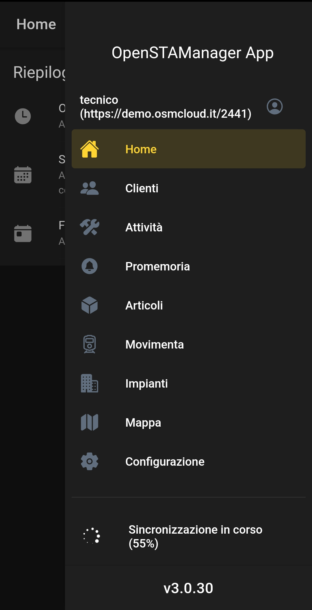

### 🌀 Sincronizzazione

Cliccando sulla Sincronizzazione si aprirà la schermata di dettaglio della sincronizzazione in corso, oppure una schermata che permetterà di effettuare una nuova sincronizzazione cliccando su AVVIA!

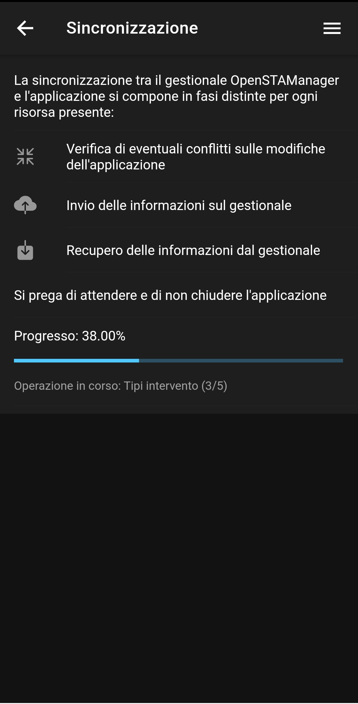

### 👥 Clienti

Da questo modulo si può visualizzare l'elenco dei clienti, di default ogni tecnico può visualizzare solo i clienti collegati alle attività a cui sono stati assegnati almeno una volta o in cui siano stati inseriti in almeno una sessione.

Per modificare questa impostazione: [Impostazioni app da gestionale](https://docs.openstamanager.com/v/2.4.42/openstamanager/app-tecnici/v3.0.30#impostazioni-app-da-gestionale)

&#x20;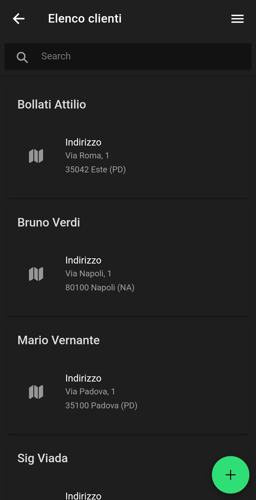

Cliccando sul tasto + è possibile inserire un nuovo cliente, verificando se la partita IVA o il codice fiscale che si stanno andando a registrare siano già presenti in anagrafica.

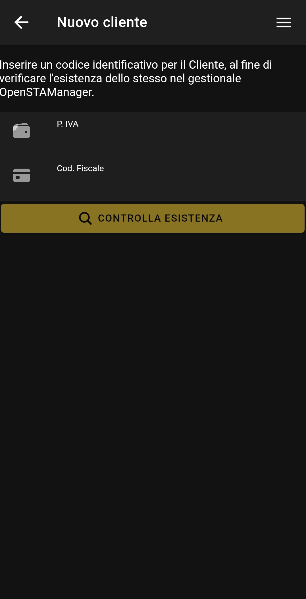

### ⚒️ Attività

Da questo modulo è possibile visualizzare tutte le attività in stato programmato, dove è presente almeno una sessione del tecnico collegato all'account da cui è stato effettuato il login.

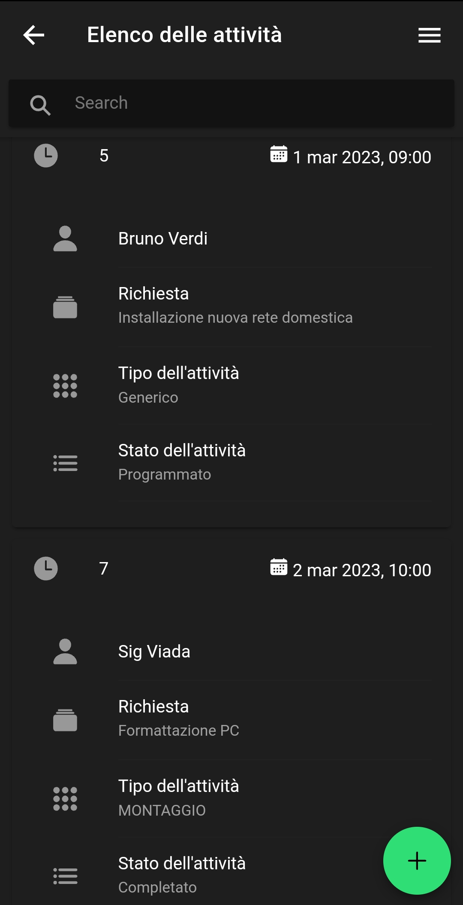

Cliccando sul tasto + è possibile inserire una nuova attività:

&#x20;

### 🔔 Promemoria

Da questo modulo è possibile visualizzare tutte le attività che non hanno nessuna sessione collegata, modificarle e aggiungerne di nuove cliccando sul tasto +.

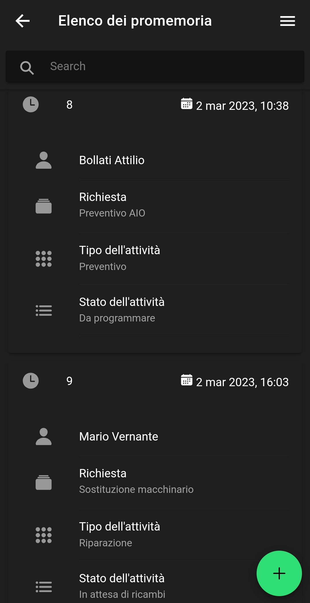

### 📦 Articoli

Da questo modulo è possibile visualizzare gli articoli presenti a magazzino, con evidenziati in rosso gli articoli con quantità pari a zero.

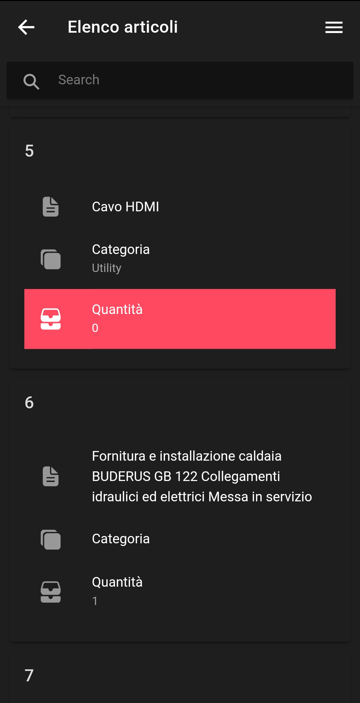

### 🚆 Movimenta

Da questo modulo è possibile movimentare manualmente degli articoli, cliccando sul tasto + e inquadrandone i barcode.

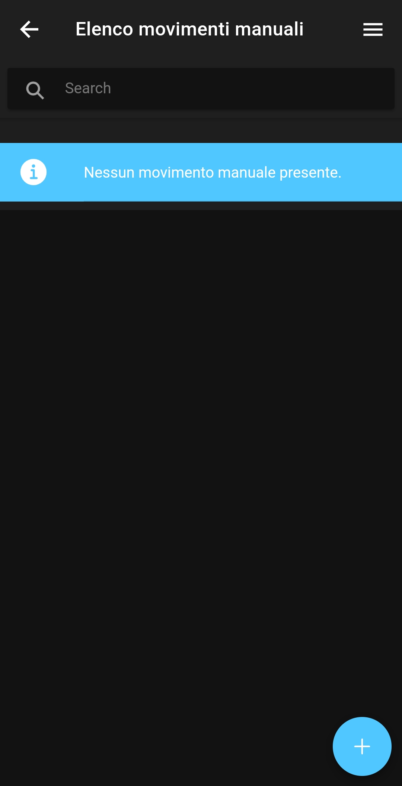

Nel caso in cui il barcode rilevato non sia collegato a nessun articolo registrato a magazzino verrà visualizzato l'avviso Articolo non trovato!

### 🏢 Impianti

Da questo modulo è possibile visualizzare l'elenco degli impianti che hanno il tecnico impostato come tecnico predefinito

### 🗺️ Mappa

### ⚙️ Configurazione

Da questo modulo è possibile:

* attivare la modalità di Debug
* impostare la lingua dell'app
* impostare in che modo ordinare le Attività
* impostare la sede predefinita di lavoro (per i movimenti manuali)
* Resettare l'applicazione

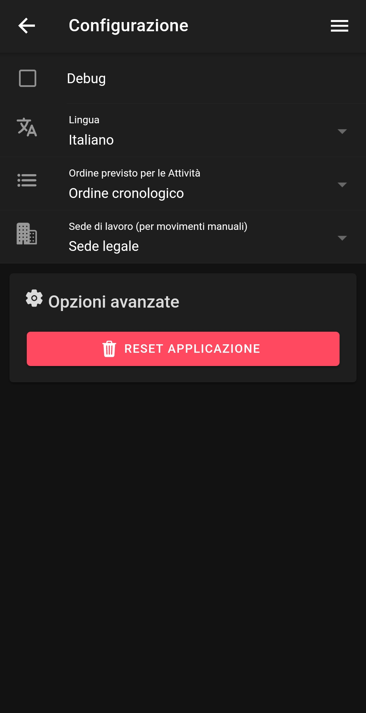

## 🪛 Impostazioni app da gestionale

Da gestionale è presente definire le seguenti configurazioni per l'app:

* Google maps API key per Tecnici
* Mostra i pezzi nell'app ai tecnici / Nascondi i prezzi ai tecnici
* Sincronizza solo i Clienti per cui il Tecnico ha lavorato in passato / Sincronizza tutti i clienti presenti
* Mesi per lo storico delle Attività
* Abilita la modifica di altri tecnici / Non permettere di assegnare attività ad altri tecnici
* Visualizza promemoria / Visualizza solo attività assegnate

<figure><figcaption></figcaption></figure>


Per poter rendere effettiva la modifica di ognuna di queste impostazioni è necessario resettare l'applicazione tramite apposito pulsante Reset applicazione e rieffettuare il login.

