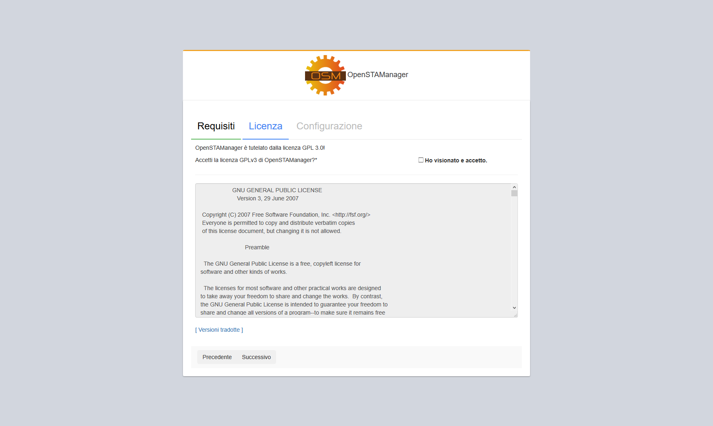
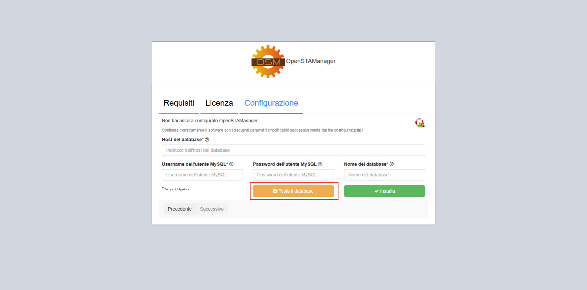
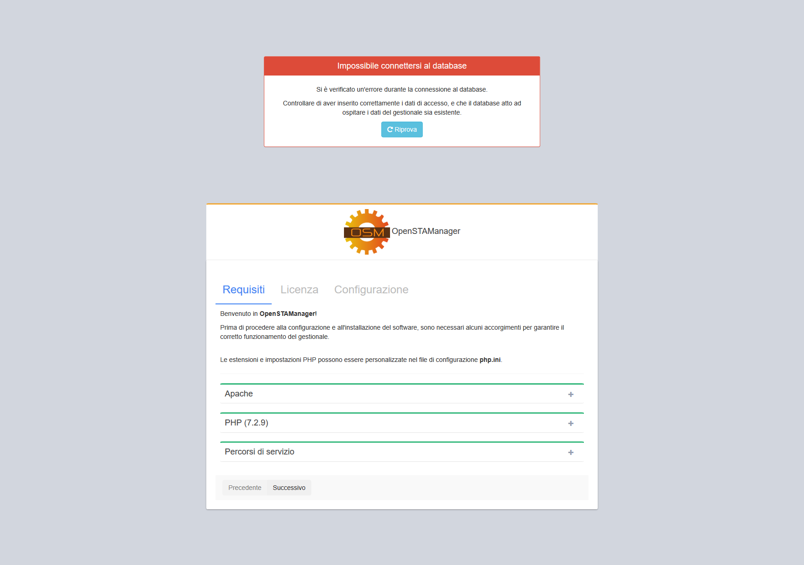

# 🎯 Installazione

### 🐱 Da GitHub

Per procedere all'installazione di OpenSTAManager è necessario seguire i seguenti punti:

1. [Scaricare una release ufficiale del progetto](https://github.com/devcode-it/openstamanager/releases).
2. Creare una cartella (ad esempio `openstamanager`) nella root del _web server_ ed estrarvi il contenuto della release scaricata (per maggiori informazioni, [consultare la documentazione tecnica](installazione.md))
3. Creare un database vuoto (tramite [PHPMyAdmin](http://localhost/phpmyadmin/) o riga di comando).
4. Accedere a [http://localhost/openstamanager](http://localhost/openstamanager) dal vostro browser.

Una volta completate le istruzioni per l'installazione del software, è necessario procedere alla sua configurazione per permetterne il funzionamento nell'ambiente di utilizzo.

### 🖥️ Da Terminale

Nel caso si stia utilizzando la versione direttamente ottenuta dalla repository di GitHub, è necessario eseguire i seguenti comandi da linea di comando per completare le dipendenze PHP (tramite [Composer](https://getcomposer.org)) e gli assets (tramite [Yarn](https://yarnpkg.com)) del progetto.

```
git clone https://github.com/devcode-it/openstamanager.git
cd openstamanager

# Installazione di composer (è consigliato utilizzare i comandi proposti su https://getcomposer.org/download/)
php -r "copy('https://getcomposer.org/installer', 'composer-setup.php');"

# Può essere saltato ma meglio scaricare dal sito ufficiale di composer
php -r "if (hash_file('sha384', 'composer-setup.php') === '55ce33d7678c5a611085589f1f3ddf8b3c52d662cd01d4ba75c0ee0459970c2200a51f492d557530c71c15d8dba01eae') { echo 'Installer verified'; } else { echo 'Installer corrupt'; unlink('composer-setup.php'); } echo PHP_EOL;"

php composer-setup.php
php -r "unlink('composer-setup.php');"

yarn develop-OSM
```

## 🔖 Requisiti


Il software permette in automatico di controllare se l'ambiente di utilizzo presenta una configurazione adeguata per il suo corretto funzionamento.


In particolare, viene richiesta la presenza di un _web server_ [Apache](https://httpd.apache.org) con il linguaggio di programmazione [PHP](http://php.net) e il [DBMS MySQL](https://www.mysql.com), richiedendo le seguenti versioni minime:

* PHP >= 7.4 < 8.0
* MySQL >= 5.7

Nel caso la versione PHP non sia compatibile, viene mostrato immediatamente un messaggio informativo a riguardo.

Successivamente, se il controllo precedente viene soddisfatto, il software verrà effettivamente avviato e sarà possibile procedere nella configurazione.

Viene quindi caricata la pagina per il controllo della configurazione del _web server_, di cui vengono controllati vari componenti:

* Moduli Apache
* Estensioni PHP
* Percorsi di servizio per il software

## ✍️ Licenza

La schermata successiva a quella dei requisiti consiste nella gestione della licenza di utilizzo del software.



OpenSTAManager viene reso disponibile tramite la licenza **GPL-3.0**, che ne permette l'uso commerciale e la personalizzazione a patto di mantenere un riferimento al progetto iniziale rimuovendo la responsabilità di eventuali problematiche agli sviluppatori originali.

Una volta accettata la licenza, cliccare su **Successivo**.


**Non è possibile procedere all'utilizzo del software senza aver accettato la licenza.**



## ⛵ Database

Una volta corretti i requisiti e accettata la licenza, viene resa disponibile la pagina dedicata alla configurazione del software per l'accesso al database MySQL.


E' possibile, una volta completate le informazioni di configurazione, procedere ad un test automatico per controllare se il database presente è completamente compatibile con il gestionale. Questa funzione è disponibile attraverso il pulsante **Testa il database**.




In ogni caso, si possono verificare degli errori duranti il salvataggio della configurazione se:

* I dati di connessione sono errati



* I permessi di creazione e scrittura sul file `config.inc.php` sono troppo restrittivi


Se le credenziali inserite sono corrette, dopo aver cliccato su **Installa** si verrà reindirizzati alla procedura automatica di installazione del database.

### 🛰️ Installazione del database

Una volta inseriti correttamente i parametri di configurazione, è sufficiente cliccare sul pulsante  per avviare l'installazione del database di OpenSTAManager.

.png>)

Appena l'installazione sarà terminata, sarà possibile cliccare su Continua e procedere con l'inizializzazione del gestionale.

.png>)
