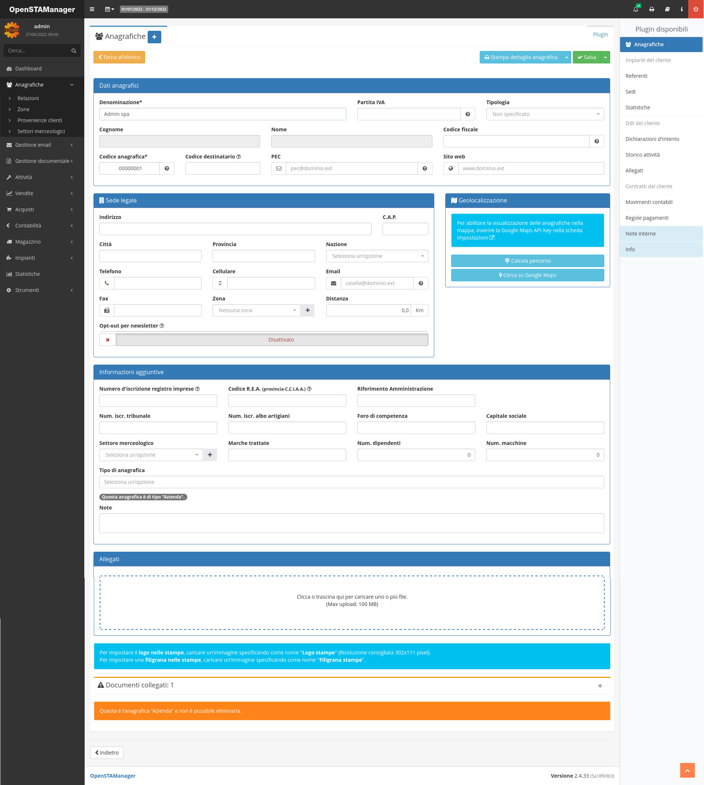

# 📚 Moduli e plugin

I moduli sono la componente principale della struttura di OpenSTAManager. Sono progettati per avere una struttura facilmente personalizzabile e mantenere comportamenti indipendenti dal resto del software.

Ogni modulo del gestionale è raggiungibile attraverso il menu laterale, ma può presentare una grafica personalizzata sulla base della funzione a cui è dedicato. Esistono però alcune caratteristiche comuni che si possono individuare quasi sempre, descritte in questa pagina.

Per ottenere maggiori informazioni sul funzionamento interno e specifico di un modulo, è necessario visitare la relativa guida dedicata.

## 📌 Pagina principale

Accedendo a ogni modulo è possibile visualizzare l'elenco generale dei record salvati in esso. Cliccando su un singolo modulo si aprirà una schermata che permetterà di andare ad analizzarlo nel dettaglio e modificarlo.

La pagina principale di un modulo può essere composta da due strutture diverse: una tabella generale oppure un sistema di contenuti personalizzati.

### 📄 Tabella generale

La schermata principale che si apre entrando in un modulo è formata da una tabella che permette una serie di operazioni comuni su tutti gli elementi registrati all'interno del modulo:

* Scorrere e visualizzare (attraverso un click) i diversi record
* Selezionare diversi record attraverso le relative righe per esportarli (in formato CSV), stamparli o copiarli
* Selezionare dei record per effettuare delle azioni generali specifiche del modulo
* Filtrare i record in base a un determinato campo utilizzando i seguenti operatori:
  * != in caso si voglia ricercare un record diverso da un dato valore;
  * \= in caso si voglia ricercare uno specifico valore;
  * \> in caso si vogliano ricercare tutti i record maggiori di un determinato valore;
  * < in caso si vogliano ricercare tutti i record minori di un determinato valore.

.png>)

### ✏️ Contenuti personalizzati

Esistono alcuni moduli che rappresentano informazioni non compatibili al formato tabellare, come ad esempio **Dashboard** e **Statistiche**, che porteranno rispettivamente alla visualizzazione di un calendario interagibile e di un grafico personalizzabile.

### 📤 Gestione degli upload

Alcuni moduli presentano una componente generale per permettere l'inserimento di file di vario tipo all'utente finale del gestionale. Questa funzione viene spiegata in [Gestione upload](gestione-upload.md).

## 📓 Operazioni sui record

### ➕ Creazione record

I moduli che permettono la creazione di nuovi elementi presentano un pulsante apposito  vicino all'intestazione della pagina.

Una volta cliccato il pulsante in questione, verrà aperta una schermata sovrapposta al resto del gestionale che permettere di inserire le informazioni del nuovo elemento.

### 📝 Modifica record

Cliccando su un singolo record è possibile accede alla schermata di dettaglio dello stesso, da cui è possibile andare ad apportarvi modifiche.

Per modificare le righe di un documento è possibile selezionare tutte le righe interessate e svolgere azioni di duplicazione o eliminazione massive.

.png>)

### 🔧 Plugin

I plugin sono dei moduli che dipendono da altri moduli, e pertanto possono essere considerati dei sotto-moduli. Ogni modulo può possedere un numero variabile di plugin, che è possibile visualizzare nella sezione destra della pagina entrando in un record.

.png>)


Per gli amministratori, è presente un plugin denominato **Info** che permette di visualizzare la cronologia del record


## 📍 Gestione dei moduli

Le operazioni di gestione dei moduli, quali abilitazione e disabilitazione, sono disponibili attraverso il modulo [Stato dei servizi](stato-dei-servizi.md). Da qui inoltre, abilitando il modulo _Viste,_ è possibile creare delle query personalizzate per cambiare la visualizzazione dei vari moduli.

## 🔍 LOG

Nel menu superiore di OpenSTAManager è possibile accedere ai LOG degli accessi cliccando sul pulsante:

<figure><figcaption></figcaption></figure>

Qui sarà possibile visualizzare che utente si è connesso, in che data e ora, lo stato del login e il suo indirizzo IP.
