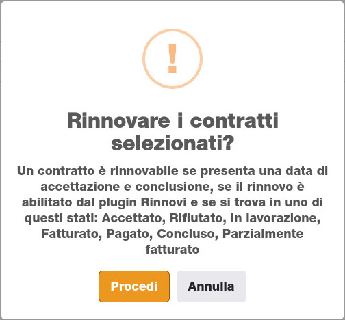

# 🚚 Attività


Il modulo **Attività** risulta essere una delle componenti fondamentali di OpenSTAManager, dedicata alla completa gestione delle attività di assistenza effettuata dai tecnici aziendali.

Questa sezione si contraddistingue, in particolare, per la possibilità di fissare in modo dinamico gli appuntamenti lavorativi e gestire contemporaneamente molteplici tecnici con le relative tariffe (oraria, al km e sul diritto di chiamata).


## ⛵ Navigazione

Il modulo è raggiungibile dal menu laterale del gestionale, sotto il link **Attività**.

<figure><figcaption></figcaption></figure>

## 🖥️ Interfaccia

Nel menu a tendina è possibile trovare i moduli Tipi di attività, Fasce orarie, Stati di attività, Tecnici e tariffe, Voci di servizio.

<figure><figcaption></figcaption></figure>

### 🔧 Plugin

Selezionando uno specifico record si può accedere a diversi plugin:

* [Impianti](plugin/impianti.md)
* [Note interne](../anagrafiche/plugin/note-interne.md)
* [Checklist](plugin/checklist.md)
* [Info](../anagrafiche/plugin/info.md)

## 🔽 Informazioni aggiuntive


[creazione.md](creazione.md)



[modifica.md](modifica.md)



[tipidiattivita.md](tipidiattivita.md)



[fasce-orarie.md](fasce-orarie.md)



[statidiattivita.md](statidiattivita.md)



[tecnicietariffe.md](tecnicietariffe.md)



[Broken link](broken-reference)



[azioni-aggiuntive.md](azioni-aggiuntive.md)



[plugin](plugin/)

