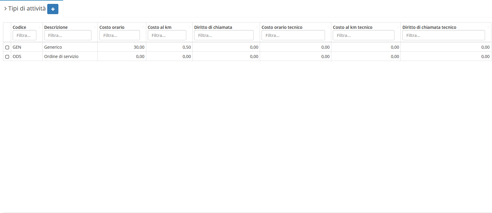

# ⛽ Tipi di attività


Il modulo **Tipi di attività** permette di creare una sorta di tariffario da assegnare ad un **Tecnico** per lo svolgimento di un'attività. Offre di base due _record_:


* GEN(Generico)
* ODS(Ordine di servizio)


Se i **Tipi di attività** sono collegati a degli interventi andando a cancellare il **Tipo di attività** collegato ad un determinato intervento, viene rimosso anche l'intervento.


## ➕ Creazione

Per creare un nuovo tipo di attività si dovrà cliccare sul tasto (+).

Andranno qui inserite le informazioni relative al nuovo tipo di attività da creare, mostrando di default una versione basilare delle informazioni richieste.

.png>)


Tempo standard accetta valori compresi tra 0.25 e 25 ore, esempi:


* 60 minuti= 1 ora
* 30 minuti= 0,5 ore
* 15 minuti= 0,25 ore

## 🖌️ Modifica

Cliccando sul record da modificare si aprirà la schermata di dettaglio, da cui sarà possibile modificare:

* Descrizione
* Tempo standard
* Addebito orario
* Addebito km
* Addebito diritto di chiamata
* Costo orario
* Costo km
* Costo diritto di chiamata
* Aggiungere righe
* Addebiti e costi per fasce orarie

.png>)
